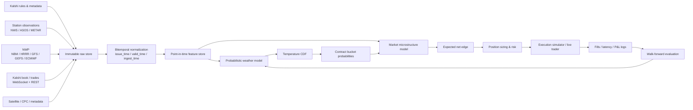
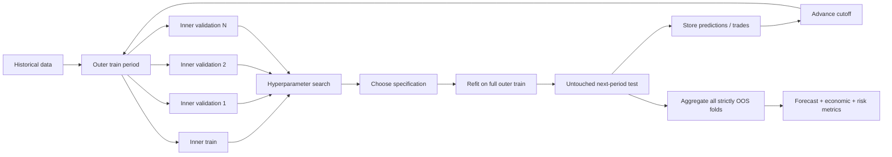

# Building an Algorithmic Trader for Temperature-Linked Kalshi Contracts

## Executive summary

A robust Kalshi temperature strategy should be designed as **three separate systems connected by a strict point-in-time data layer**:

1. a **meteorological model** that estimates a calibrated probability distribution for the exact settlement temperature;
2. a **market model** that converts that weather distribution plus Kalshi microstructure into an estimate of tradable mispricing; and
3. an **execution/risk engine** that decides whether the expected edge remains positive after fees, bid-ask spread, slippage, latency, queue risk, and correlated exposure.

The most important design decision is to model **the contract's settlement variable, not generic “city weather.”** As of September 2026, Kalshi says its daily high/low temperature markets settle from the final National Weather Service Daily Climate Report for the station named in the rules, normally the following morning. Hourly temperature markets instead use The Weather Company at the specified station coordinates and generally settle about 25–35 minutes after close. Kalshi also notes that NWS daily climate reports use **local standard time**: during daylight-saving time, the relevant daily window is effectively 1:00 a.m. through 12:59 a.m. daylight time rather than civil midnight-to-midnight. citeturn21view0

That seemingly mundane detail is strategically critical. A one-hour DST error, wrong weather station, wrong rounding convention, or wrong resolution feed can make an otherwise sophisticated model systematically predict the wrong target.

**Recommended architecture.** For daily-high contracts, forecast the latent continuous final daily maximum \(T_{\max}\), preferably as a full predictive distribution \(F(T)\), and derive every Kalshi bucket probability from that single coherent CDF. For a bucket \([L,U]\),

\[
P(L \le T_{\max}\le U)=F(U^*)-F(L^*)
\]

where the effective boundaries \(L^*,U^*\) reproduce the contract's exact rounding and inclusion rules. This is preferable to training independent YES/NO models for every bucket because a single distribution automatically produces mutually consistent probabilities summing to one.

The highest-value raw inputs are likely to be: **the exact settlement-station observations; NBM; HRRR; GEFS/GFS; NWS/METAR observations; station metadata; historical Kalshi prices/trades; and, prospectively, your own captured Kalshi order book.** NBM is particularly useful as a strong baseline because the current system already blends guidance from multiple sources, including GFS/GEFS, HRRR, LAMP/GLMP and ECMWF guidance. HRRR adds high-resolution, frequently updated short-range information; GEFS adds ensemble uncertainty. citeturn4search1turn4search2turn16search1turn16search5

The initial model should **not** be a large deep neural network. A better progression is: climatology/persistence → bias-corrected NWP → EMOS/distributional regression → gradient-boosted or quantile-regression postprocessing → carefully stacked ensemble. Statistical postprocessing exists precisely because raw NWP ensembles are systematically biased and under/over-dispersed, and EMOS, quantile regression forests, and related techniques have a substantial forecasting literature behind them. citeturn12search18turn12search13turn12search1

The likely source of tradable edge is therefore not “build a better global weather model than NOAA/ECMWF.” It is more plausibly:

\[
\text{edge}
=
\text{NWP postprocessing}
+
\text{station-specific bias}
+
\text{intraday observations}
+
\text{better uncertainty calibration}
+
\text{market microstructure}
-
\text{execution costs}.
\]

Kalshi's API provides public market data, historical markets/trades/candlesticks, and real-time WebSocket trade and order-book feeds. Its documented historical API currently exposes historical trades and 1-minute/60-minute/1-day candlesticks but does not list an equivalent historical full-depth order-book reconstruction endpoint. I therefore recommend **capturing WebSocket order-book deltas yourself from day one**; this conclusion is an inference from the currently documented API surface. citeturn18search4turn23search0turn23search1turn23search2turn23search4turn23search7

Finally, model evaluation must be finance-aware. Lower RMSE is insufficient. A successful research result should simultaneously show: lower out-of-sample CRPS/Brier score; good calibration near the contract thresholds; positive **net** expected and realized P&L after realistic execution; robustness across cities, seasons and forecast horizons; controlled drawdown; and statistical evidence that results are not merely the best outcome among many tried configurations. Proper scoring rules are the right foundation for probability forecasting, while data-snooping corrections such as White's Reality Check, Hansen's SPA test and the Deflated Sharpe Ratio are useful safeguards once many strategies have been explored. citeturn12search0turn13search2turn13search3turn13search0

## Data architecture and source priority

The dataset should be **bitemporal**. Every record should contain at least:

\[
(\text{event time},\ \text{issue time},\ \text{receipt/ingest time},\ \text{source version})
\]

rather than merely a weather-valid timestamp. The distinction is essential: a model run valid for 3 p.m. tomorrow may not have been published yet at your simulated decision time, while an observation timestamped 2:00 p.m. might not have reached your system until 2:05 p.m.

The research database should also preserve raw, immutable source payloads before normalization. That gives you the ability to reconstruct exactly what the strategy knew at any historical decision timestamp.

### Prioritized data-source inventory

| Priority | Source | What to collect | Access | Native cadence / practical latency | Role |
|---|---|---|---|---|---|
| **S** | **Kalshi market/series metadata and rules** | ticker, event, strike/bucket, close time, settlement source, station, rules/version | Kalshi REST `/series`, `/events`, `/markets` | Event-driven; query when markets appear/change | Defines the actual prediction target. Kalshi series represent recurring contract templates and include settlement metadata. citeturn22search1turn18search6 |
| **S** | **Final NWS Daily Climate Report / CLI** | final daily maximum/minimum, settlement station | NWS products / contract-linked resolution source | Usually final following morning for Kalshi daily contracts | Ground-truth label for current daily high/low contracts. citeturn21view0 |
| **S** | **Kalshi live order book + trades** | every L2 snapshot/delta, trade, sequence number, local receipt timestamp | Kalshi WebSocket; REST snapshot for recovery | Event-driven; trade updates sent immediately after execution | Needed for genuine execution backtests. Kalshi documents incremental real-time order-book updates and public trade notifications. citeturn23search0turn23search1 |
| **S** | **Settlement-station ASOS/METAR** | temperature, dew point, wind, clouds, pressure, max/min indications and QC flags | NWS API, AviationWeather.gov, NCEI | ASOS produces high-frequency observations; METAR reports are commonly hourly/special, while AviationWeather's current cache refreshes approximately every minute | Critical intraday nowcast and station-bias signal. NCEI archives include 1-minute and 5-minute ASOS products. citeturn8view2turn8view1 |
| **A** | **NBM** | 2-m temperature and probability/quantile guidance; other surface variables | NOAA NOMADS/NODD GRIB2 | Runs hourly; forecast horizon depends on product | Best “strong baseline” candidate because NBM combines multiple guidance sources and provides probabilistic products. citeturn16search2turn16search5 |
| **A** | **HRRR** | 2-m T, dew point, cloud, radiation, wind, soil/surface variables | NOMADS / NOAA cloud archive | New run hourly; 3-km CONUS model; extended forecasts at selected cycles | Primary very-short-range regional model and intraday update source. citeturn4search1turn4search2 |
| **A** | **GEFS** | member-level 2-m temperature and related fields | NOMADS/NODD | Four cycles/day in NOAA's current NOMADS catalog | Distribution/spread and threshold probabilities; especially useful before same-day observations dominate. citeturn4search2 |
| **A** | **GFS** | deterministic surface/upper-air forecast fields | NOMADS/NODD | Four cycles/day; current NOMADS 0.25° output | Large-scale regime and deterministic baseline. citeturn4search2 |
| **A** | **GHCNh / station archive** | historical hourly/synoptic station observations | NCEI bulk HTTPS/Parquet-style distributions | Historical/archive updates | Preferred modern NOAA hourly historical station dataset. NCEI introduced GHCNh as the successor to legacy ISD and expanded source coverage. citeturn0search7turn0search10turn0search12 |
| **A** | **HOMR** | station coordinates, elevation, identifiers, moves/instrument metadata | NCEI HOMR API/web services | Metadata changes infrequently | Prevents false “model drift” caused by station moves or instrumentation changes. citeturn0search9 |
| **B** | **ECMWF IFS/ensemble open data** | deterministic and member/ensemble fields available in open subset | ECMWF Open Data Python/API/HTTPS | Current official client exposes 00/06/12/18 UTC cycles; publication availability varies by cycle/forecast step | Model-diversity signal valuable when ECMWF disagrees with NOAA guidance. citeturn6search0turn6search1 |
| **B** | **RTMA/related analyses** | analyzed near-surface T/dew point/wind | NOMADS | NOAA currently lists hourly and rapid-update products | Spatial estimate of current atmospheric state; useful where station coverage is sparse. citeturn4search2 |
| **B** | **MADIS** | mesonet/aviation/surface observations with QC | NOAA MADIS | Source-dependent; QC/processing may add latency | Neighbor-station and local spatial features. MADIS normalizes multiple observation networks and maintains an archive extending back to 2001. citeturn0search3 |
| **B** | **ERA5** | hourly reanalysis T, radiation, wind, soil/surface variables | Copernicus Climate Data Store API | Hourly historical field; current ERA5 production is delayed by several days | Climatology, anomaly construction, regime studies—not a substitute for operational historical forecasts. citeturn5search2 |
| **B** | **ERA5-Land** | higher-resolution land surface, soil and near-surface variables | CDS API | Hourly, historical; updated with reanalysis latency | Soil moisture/heat-storage and land-surface climatology. citeturn5search8 |
| **C** | **GOES imagery/products** | cloud cover, clear-sky/land-surface thermal signals, smoke/cloud evolution | NOAA/NESDIS/NODD | Near-real-time; exact scan cadence and delivery vary by sector/product | Optional same-day nowcast enhancement, most promising when cloud evolution drives maximum-temperature error. NOAA distributes satellite products through its open-data infrastructure. citeturn17search0turn17search14 |
| **C** | **NOAA CPC climate indices** | Niño 3.4, SOI, QBO and related indices | CPC files/web | Weekly/monthly depending index | Slow-changing regime covariates; likely modest marginal value for a daily station-level strategy. citeturn16search0 |
| Contract-specific | **Kalshi Weather Index** | minute-resolution city temperature index and underlying member details where available | Kalshi `/live_data/weather/{city}` | Minute-resolution index | Important for Kalshi's hourly-temperature ecosystem rather than blindly mixing it into NWS daily-settlement targets. Kalshi documents index values at minute resolution and a separate calibration-history endpoint. citeturn18search1turn18search2 |

Two caveats matter particularly.

First, the NWS API is excellent for operational use but should not be treated as a perfectly instantaneous sensor feed. NWS notes that observations routed through MADIS can experience QC-related delays of up to roughly 20 minutes, and NWS has documented caveats around some max/min fields. Preserve both source timestamp and receipt timestamp instead of retrospectively pretending that every observation was available immediately. citeturn8view0

Second, **ERA5 is reanalysis, not an archived operational forecast.** ERA5 assimilates observational information in a retrospective analysis system; its current product is updated with an approximately several-day delay. It is appropriate for climatologies and physical covariates but using ERA5 values as though they were historically observable forecasts at decision time creates look-ahead bias. citeturn5search2

For operational model archives, prefer point-in-time NOAA NOMADS/NODD products. NOAA's open-data program makes original NOAA datasets available on cloud platforms, while NOMADS publishes current GFS, GEFS, HRRR, NBM, RAP, RTMA and related products. citeturn17search1turn17search8turn4search2

**Kalshi data deserves its own capture process.** Public market data endpoints do not require authentication for basic retrieval, and historical APIs expose archived markets, trades and candlesticks; archived candlesticks are documented at 1-, 60- and 1,440-minute periods. The current historical API menu contains historical markets, market candlesticks, trades, fills, orders and positions but no historical L2 book replay endpoint. Thus, for execution-grade research, begin saving real-time WebSocket book deltas immediately. citeturn18search4turn23search2turn23search3turn23search4turn23search7



## Features, forecasting models, and signal synthesis

The cleanest decomposition is:

\[
T_{\text{settle}}
=
T_{\text{NWP}}
+
b_{\text{station, model, lead, regime}}
+
\epsilon,
\]

where \(b\) is a learned local systematic correction and \(\epsilon\) becomes a calibrated predictive distribution rather than a point-error term.

**Spatial features.** Never rely solely on the nearest raw NWP grid point. For every settlement station and model run, create nearest-grid, bilinear-interpolated, and local-neighborhood statistics such as mean/min/max/gradient over a small stencil. Include station-minus-grid elevation, land/water characteristics where available, and neighboring-station temperature anomalies. Learn historical station-specific residuals separately by model, forecast lead, hour and season.

For example,

\[
r_{m,t}=T^{\text{obs}}_t-T^{\text{NWP}}_{m,t}
\]

and features such as exponentially weighted residual averages,

\[
\bar r_{m,t}^{(\lambda)}
=
(1-\lambda)r_{m,t-1}+\lambda\bar r_{m,t-1},
\]

can adapt to persistent local model bias.

**Thermodynamic and intraday-state features.** Use current temperature, maximum-so-far, minimum-so-far, temperature tendency over 5/15/30/60 minutes, dew point, humidity, wind direction/speed, cloud coverage, pressure tendency, solar/radiative fields, soil temperature/moisture, snow cover and model boundary-layer variables where available. HRRR's hourly, convection-permitting design and surface fields make it particularly valuable for these short-range features. citeturn4search1

For same-day high-temperature contracts, highly informative engineered quantities include:

\[
\Delta_{\text{forecast}}
=
T_{\max,\text{forecast}}-T_{\max,\text{observed so far}}
\]

and for a bucket threshold \(K\),

\[
d_K=K-T_{\max,\text{observed so far}}.
\]

A market one degree above the observed maximum at 9 a.m. is fundamentally different from that same one-degree gap at 4:30 p.m.

**Anomalies and climatology.** Express temperatures relative to station/hour/day-of-year climatology:

\[
A_t=T_t-C(\text{station}, \text{DOY}, \text{hour}),
\]

and similarly express forecast errors as model/lead/month anomalies. ERA5 and long station archives are well suited to constructing these slow-moving baselines, provided they are not mistaken for point-in-time operational forecasts. citeturn5search2turn0search7

**Persistence and degree-day variables.** Include previous-day maximum/minimum, overnight minimum, prior 1/3/7-day temperature anomaly, heating/cooling degree days and degree-hours, especially because persistent air masses and soil/urban heat storage can carry information not perfectly represented by one model cycle. Degree-day features are likely secondary to direct NWP guidance for a one-day target but can improve regime characterization.

**Ensemble features.** Do not reduce GEFS or other ensemble guidance to a mean. Calculate member:

- mean/median and standard deviation;
- p05/p10/p25/p50/p75/p90/p95;
- skew/tail measures;
- fraction crossing each contract threshold;
- member-specific daily maxima over the **exact settlement-day time window**;
- run-to-run change;
- spread change;
- disagreement between models;
- age of newest available forecast.

The ideal transformation is to compute a daily maximum **inside each ensemble member first**, then estimate the distribution across member maxima. Taking the maximum of an ensemble-mean hourly temperature series destroys information about uncertainty and nonlinear timing.

**Blending.** Start with a convex blend:

\[
\hat T
=
\sum_m w_m\hat T_m,
\qquad
w_m\ge0,\quad \sum_mw_m=1,
\]

with weights learned by city, season and forecast lead. Then advance to distributional stacking minimizing out-of-fold CRPS or log loss. Statistical postprocessing literature emphasizes correcting both systematic bias and ensemble dispersion rather than merely optimizing deterministic error. citeturn12search18turn12search1

NBM should be both a feature source and a benchmark, but take care when feeding NBM alongside all of its underlying model constituents: because NBM already incorporates multiple guidance systems, naïvely adding NBM, HRRR, GFS, GEFS and ECMWF can create substantial redundancy. NBM's current input inventory includes GFS/GEFS, HRRR, LAMP/GLMP and ECMWF guidance. citeturn16search1turn16search5

**Calendar and exogenous features.** Use cyclic encodings for day of year and hour:

\[
x_{\sin}=\sin(2\pi d/365.25),\qquad
x_{\cos}=\cos(2\pi d/365.25).
\]

Solar elevation/day length are physically stronger than generic weekday features. Holidays and weekdays should mostly enter the **market/execution model**, where they may affect participation and liquidity, rather than being given high importance in the physical temperature model. CPC ENSO/SOI/QBO variables can be tested as slow regime features but should be considered low priority at one-day, one-station horizons. citeturn16search0

### Model comparison

| Model class | Best use | Advantages | Main risks for Kalshi |
|---|---|---|---|
| **Climatology + persistence** | Benchmark | Extremely hard to accidentally overfit; diagnoses whether advanced model adds genuine information | Weak when weather regime changes quickly |
| **Bias-corrected NWP / linear regression** | First deployable model | Interpretable, robust, small sample requirement | Cannot easily model nonlinear threshold behavior |
| **EMOS / nonhomogeneous Gaussian regression** | Calibrated distribution from ensemble NWP | Purpose-built for probabilistic NWP postprocessing; efficient and interpretable | A simple Normal distribution may underrepresent skew/heavy tails; distribution must match variable/lead. EMOS is an established ensemble-postprocessing approach. citeturn12search18 |
| **Bayesian model averaging / mixture distributions** | Multi-model blending | Natural representation of model disagreement and multimodality | More parameters; unstable with small local samples |
| **GAM / distributional GAM** | Seasonal + smooth nonlinear effects | Interpretable smooth effects for DOY, lead, humidity, model bias | Less expressive for complex interactions |
| **Quantile regression** | Direct conditional quantiles | Distribution-free and easy to map into bucket probabilities | Quantile crossing unless explicitly constrained |
| **Quantile regression forest** | Nonlinear distributional correction | Handles interactions, gives empirical conditional distribution; has been used in ensemble postprocessing research. citeturn12search13 | Poor extrapolation at unseen extremes; larger data requirement |
| **Gradient-boosted trees** | Strong tabular benchmark | Excellent for heterogeneous station/NWP/microstructure features; fast experiments | Probability calibration usually needs explicit attention; easy to overtune |
| **Distributional boosting / NGBoost-style models** | Full parametric predictive distribution | Directly targets uncertainty rather than only mean | Distributional assumptions and hyperparameters can still miscalibrate tails |
| **Sequence models: TCN/LSTM/TFT-like architectures** | Large multi-station intraday dataset | Can learn nonlinear temporal interactions | Often data-hungry; harder to calibrate/debug; easy to beat in-sample but not economically |
| **Deep ensemble/postprocessor** | Large pooled cross-city system | Can pool information and jointly learn distributional corrections; neural ensemble postprocessing has demonstrated CRPS improvements in large meteorological datasets. citeturn12academia39 | Compute/complexity, calibration, model-version drift |
| **Stacked ensemble** | Final production candidate | Usually best way to combine structurally different errors | Stacking becomes leakage if base predictions are not generated strictly out-of-fold |

My recommended progression is therefore:

**NBM → NBM bias correction → NBM + HRRR/GEFS EMOS → gradient-boosted/quantile model → stacked combination.**

Deep learning becomes justified only after the simpler methods have plateaued and you have pooled enough city-days and intraday sequences.

The final weather system should output \(F_t(T)\), not only \(\hat T_t\). From it, generate:

\[
p_{t,k}=P(T_{\text{settle}}\in B_k\mid\mathcal I_t)
\]

for every Kalshi bucket \(B_k\).

Then enforce

\[
p_{t,k}\ge 0,\qquad \sum_k p_{t,k}=1.
\]

For tail contracts, use the corresponding CDF tail probability.

**Market signal synthesis** should be a second stage. One interpretable form is

\[
\operatorname{logit}(p_{\text{trade}})
=
\operatorname{logit}(p_{\text{weather}})
+
g(X_{\text{market}}),
\]

where \(X_{\text{market}}\) includes spread, depth, order imbalance, recent trades, price momentum, time to close, forecast-update age and perhaps the discrepancy between market-implied probability and your weather probability.

This architecture forces the market model to answer a narrower question: **given what the meteorology says, when is the market's deviation from it informative versus exploitable?**

For a YES contract with executable ask \(a\), a simplified expected value before capital/time effects is

\[
EV_{\text{YES}}
=
p_{\text{weather}}-a-\text{fees}-\text{expected slippage/adverse selection}.
\]

Kalshi contracts are binary outcome contracts, and current Kalshi materials emphasize that transaction fees can vary by market, so the simulator should reproduce the applicable fee schedule rather than assume one permanent percentage. citeturn18search10turn20search5

Do **not** trade merely because \(p_{\text{model}}>p_{\text{market}}\). Require

\[
|\text{model edge}|
>
\text{spread}
+
\text{fee}
+
\text{slippage}
+
\text{model-uncertainty buffer}.
\]

That uncertainty buffer should widen in regimes where your historical calibration is weak: rare heat events, station outages, changing model versions, or contract temperatures close to a bucket boundary.

## Validation, backtesting, and model selection

Random train/test splits are inappropriate. Weather is autocorrelated, NWP systems change over time, station behavior can drift, Kalshi's market structure evolves, and adjacent forecast cases may reuse nearly identical model information. The goal is to estimate performance on **future market events using only data genuinely available before each simulated decision**.

### Validation alternatives

| Method | Structure | When to use | Strength | Weakness |
|---|---|---|---|---|
| **Expanding walk-forward** | Train `[start…t]`, validate `[t+1…t+h]` | Default | Maximizes historical training sample while preserving chronology | Old regimes remain forever |
| **Rolling walk-forward** | Train latest \(W\) months/years only | Model/station/market drift | Adapts to changing model versions and microstructure | Throws away older rare extremes |
| **Nested walk-forward** | Outer future holdout; inner walk-forward for tuning | Final model comparison | Separates hyperparameter search from final evaluation | Computationally expensive |
| **Purged/embargoed walk-forward** | Remove observations adjacent to validation boundary | Features/labels span overlapping time intervals | Reduces subtle temporal leakage | Smaller sample |
| **Cross-city holdout** | Train on cities A–N, test unseen city | Testing transferability | Reveals whether model learns meteorology or memorizes stations | Not identical to production goal |
| **Season/regime stress tests** | Hold out heat waves, cold spells, seasons | Tail-risk analysis | Exposes failure exactly where binary contracts can be most sensitive | Not a replacement for chronological OOS |

The core production research protocol should be **nested walk-forward**.



Suppose an outer fold trains through June 30 and tests July. Every July decision must use the newest forecast and observation that **would actually have been received by that timestamp**. When July is finished, advance the cutoff. Hyperparameters selected using July itself are prohibited.

That requires an as-of join resembling:

```text
feature.issue_time   <= decision_time
feature.ingest_time  <= decision_time
observation.received <= decision_time
market_snapshot.time <= decision_time
```

rather than merely

```text
feature.valid_time == event_time
```

This is arguably the most important implementation rule in the project.

**High-risk leakage channels include:**

final climate data inadvertently included in same-day features; ERA5 treated as a contemporaneous forecast; downloading the latest revised version of an NWP file rather than the archived version available then; calculating model bias using the target day's final temperature; using the closing Kalshi price to simulate a trade supposedly entered earlier; normalizing on the full dataset; fitting ensemble blending weights on the test period; or using base-model predictions generated in-sample when training a stacker.

### Backtesting engine

A credible backtest should have two layers.

**Forecast backtest.** Ignore detailed execution and ask: did the weather probability beat climatology, NBM and the market's probability? This identifies whether meteorological alpha exists.

**Execution backtest.** Reconstruct actual bid/ask/depth at the decision time, apply a latency delay, submit the simulated order, determine fill probability/quantity, deduct fees and model adverse selection.

The second requires an event-driven order-book simulator. Because Kalshi's real-time API provides incremental order-book updates and trades immediately after execution, capturing those streams lets you rebuild a sequence-numbered market state. citeturn23search0turn23search1

For a taker simulation, consume actual displayed depth level by level after an assumed latency \(L\). For passive orders, do **not** assume every touched price fills. At minimum estimate queue-ahead volume and decrement it using subsequent trades and cancellations; present results across optimistic/base/pessimistic queue assumptions.

Run sensitivity grids such as:

\[
L\in\{50\text{ ms},250\text{ ms},1\text{ s},5\text{ s},30\text{ s}\}
\]

and progressively harsher slippage assumptions. The specific numbers are scenario parameters, not assertions about your actual infrastructure.

### Evaluation metrics

| Metric | What it answers | Recommended interpretation |
|---|---|---|
| **MAE / RMSE** | Is expected temperature accurate? | Diagnostic only; cannot determine probability quality alone |
| **CRPS** | Is the full continuous predictive distribution accurate and sharp? | Primary weather-distribution score; proper scoring rules incentivize honest probabilities. citeturn12search0turn12search18 |
| **Brier score** \(\frac1N\sum(p_i-y_i)^2\) | Are contract probabilities accurate? | Primary bucket-level score |
| **Log loss** | Are confident probability errors punished appropriately? | Particularly valuable for detecting dangerous overconfidence |
| **Calibration/reliability curve** | Does “70%” resolve about 70% of the time? | Essential for sizing decisions |
| **PIT / rank histogram** | Is continuous distribution calibrated? | Detects bias and too-narrow/too-wide forecasts |
| **Sharpness / interval width** | How concentrated are useful forecasts? | Judge only conditional on calibration |
| **Gross/net P&L** | Does prediction become money? | Always report both to expose execution drag |
| **Sharpe** | P&L per unit overall volatility | Useful summary but potentially misleading with non-normal/sparse event returns |
| **Sortino** | Return relative to downside volatility | Better complement when upside volatility is not undesirable |
| **Max drawdown** | Worst peak-to-trough loss | Direct operational risk measure |
| **Calmar-like ratio** | Return relative to drawdown | Useful secondary risk statistic |
| **Hit rate** | Fraction of profitable trades | Secondary only; can be high while EV is negative |
| **Turnover** | How much trading produces the P&L? | Reveals cost sensitivity |
| **Average modeled edge / captured edge** | How much forecast edge survives execution? | Separates forecasting from implementation |
| **Fill rate** | Can orders realistically execute? | Especially important for passive strategies |
| **Realized slippage** | Difference between decision and execution economics | Must be segmented by liquidity/time-to-close |
| **P&L by city/month/lead/bucket** | Where does strategy work? | Detects hidden concentration |
| **Economic utility / log growth** | Does sizing translate edge into sustainable growth? | Useful for comparing strategies with different capital usage |

Probability scores should be treated as first-class objectives. Gneiting and Raftery's proper-scoring-rule framework explains why proper scores such as Brier/logarithmic scores reward calibrated probabilistic forecasts rather than merely point accuracy. citeturn12search0turn12search9

**Statistical inference must account for dependence.** Ordinary IID bootstrapping can destroy temporal dependence; stationary/block bootstrap techniques were explicitly developed to resample dependent time series. Bootstrap at the day or weather-event cluster level, and consider larger regional clusters when several cities experience the same synoptic system. citeturn17search2turn17search3

After testing many models and trading rules, conventional “best Sharpe” selection is particularly dangerous. White's Reality Check was designed for inference under data snooping; Hansen's Superior Predictive Ability test improves power when comparing many alternatives; the Deflated Sharpe Ratio adjusts performance inference for selection effects and non-normality. citeturn13search2turn13search3turn13search0

A defensible model-selection hierarchy is:

\[
\boxed{
\text{Calibration}
\rightarrow
\text{CRPS/Brier}
\rightarrow
\text{net economic utility}
\rightarrow
\text{complexity}
}
\]

not “highest backtest Sharpe wins.”

For hyperparameter search, use random search or Bayesian/TPE-style optimization **inside the inner walk-forward loop**. Keep the search space deliberately small, record every experiment attempted, and apply a simplicity tie-break: if two models have economically indistinguishable outer-fold results, choose the simpler one.

## Reproducible implementation and trading controls

A practical stack can remain largely Python-native:

```text
GRIB / NetCDF:
    xarray + cfgrib/ecCodes

Tabular processing:
    Polars or Pandas
    PyArrow / Parquet

Local analytical warehouse:
    DuckDB

Large gridded archive:
    object storage + Zarr/Parquet

Modeling:
    statsmodels / scikit-learn
    gradient boosting library
    PyTorch only when deep models become justified

Experiment tracking:
    MLflow or equivalent

Orchestration:
    lightweight scheduled jobs initially;
    Prefect / Dagster / Airflow once operational complexity warrants it
```

The key is not a particular library. It is immutable inputs, deterministic feature computation and point-in-time reproducibility.

A suggested repository:

```text
temperature-kalshi/
├── configs/
│   ├── cities/
│   ├── models/
│   └── execution/
├── src/
│   ├── ingest/
│   │   ├── kalshi.py
│   │   ├── nws.py
│   │   ├── aviation_weather.py
│   │   ├── noaa_nwp.py
│   │   └── ecmwf.py
│   ├── normalize/
│   ├── station_mapping/
│   ├── features/
│   ├── probability/
│   ├── models/
│   ├── calibration/
│   ├── backtest/
│   │   ├── event_clock.py
│   │   ├── orderbook.py
│   │   ├── fills.py
│   │   └── fees.py
│   ├── strategy/
│   ├── risk/
│   └── live/
├── notebooks/
│   ├── contract_audit.ipynb
│   ├── station_qc.ipynb
│   ├── nwp_skill.ipynb
│   ├── probabilistic_baselines.ipynb
│   ├── ensemble_postprocessing.ipynb
│   ├── market_efficiency.ipynb
│   ├── execution_costs.ipynb
│   └── walk_forward_results.ipynb
├── tests/
├── manifests/
└── reports/
```

The canonical feature table should contain fields resembling:

```text
event_id
market_ticker
series_ticker
settlement_station_id

decision_time_utc
target_local_date
target_standard_time_window
forecast_issue_time
forecast_valid_time
source_receipt_time

model_name
model_version
forecast_lead_hours

temperature_observed
temperature_max_so_far
nwp_temperature
ensemble_p10
ensemble_p50
ensemble_p90

yes_bid
yes_ask
no_bid
no_ask
book_depth
trade_imbalance

target_final_temperature
target_bucket
```

Raw Kalshi market metadata should be snapshotted rather than reconstructed from memory because series/market metadata controls settlement and strike interpretation. Kalshi's current API describes markets as binary outcomes with prices, volumes and settlement rules, while series define recurring structures and settlement sources. citeturn18search10turn22search1

For hourly-temperature research, Kalshi's own Weather Index should be versioned alongside its calibration history: Kalshi currently documents a minute-resolution city index and an append-only calibration timeline containing station weights/offsets and effective times. citeturn18search1turn18search2

**Data QA tests should be unusually aggressive.** At minimum:

```text
assert probabilities_sum_to_one(event)
assert no_feature_ingest_time_after_decision_time()
assert exact_standard_time_window(target_date)
assert fahrenheit_celsius_round_trip()
assert station_id_matches_contract_rule()
assert model_run_existed_at_decision_time()
assert orderbook_sequence_has_no_unexplained_gap()
assert final_label_matches_archived_resolution_source()
```

DST tests deserve hand-written fixtures because Kalshi explicitly states that its NWS climate-report daily temperature window follows local standard time. citeturn21view0

**Risk controls should operate at the event level, not merely individual ticker level.** Several temperature ranges within a daily-high event are mutually exclusive representations of the same underlying random variable, while several nearby cities may share the same air mass. Limit:

- maximum loss per temperature event;
- total exposure per city/day;
- total correlated regional exposure;
- exposure to one model regime;
- percentage of bankroll at one threshold;
- daily drawdown and consecutive-data-error limits.

A fractional Kelly framework can be useful once probabilities are demonstrably calibrated, but full Kelly is unnecessarily fragile to small probability errors. For a fee-free binary contract bought at \(c\), the idealized Kelly fraction of bankroll staked is related to

\[
f^*=\frac{p-c}{1-c}
\]

when \(p>c\). In production, use a fraction of this amount and cap it further for calibration uncertainty, liquidity, common-factor exposure and settlement ambiguity.

I would treat fractional Kelly as a **sizing ceiling**, not an instruction to maximize leverage.

Operational kill switches should halt trading if the settlement station stops reporting, book sequences are missing, NWP data are stale, clock synchronization fails, a contract's settlement metadata changes, observed-versus-received timestamps become inconsistent, or realized slippage sharply exceeds its calibrated envelope.

## Failure modes and mitigations

The highest-risk failures are not necessarily sophisticated machine-learning errors.

| Failure mode | How it produces false alpha | Mitigation |
|---|---|---|
| **Wrong settlement source/station** | Model accurately predicts a different thermometer | Parse and store contract rules; station mapping becomes a required key, never a manual assumption. Kalshi explicitly says the listed official source determines settlement. citeturn21view0 |
| **DST/day-boundary error** | Daily maximum calculated over wrong 24 hours | Build the local-standard-time interval explicitly. During DST, Kalshi notes the climate-report window shifts relative to civil midnight. citeturn21view0 |
| **Rounding/bucket mismatch** | Continuous forecast appears correct but wrong binary resolves | Unit-test every threshold and inclusive/exclusive boundary against settled contracts |
| **Preliminary vs final observation** | Strategy thinks outcome is certain before official value stabilizes | Keep preliminary and final fields separately; Kalshi warns final climate values can differ and settlement may be delayed when reports conflict. citeturn21view0 |
| **Observation latency leakage** | Backtest uses 2:00 observation for a 2:00 trade although data arrived later | Preserve source and receipt timestamps; NWS notes MADIS-fed data may be QC-delayed. citeturn8view0 |
| **Reanalysis leakage** | ERA5 retrospectively reconstructs state better than trader knew | Use ERA5 only for permissible historical climatology/covariates; use archived operational forecasts for simulated predictions. citeturn5search2 |
| **Latest-file bias** | Historical forecast silently replaced/revised | Immutable raw archive keyed by run/issue/ingest timestamp |
| **NWP model upgrades** | Training and test distributions represent different forecast systems | Track model version; evaluate rolling windows and pre/post-upgrade performance |
| **Station changes** | Apparent climate/model bias arises from physical station change | Incorporate HOMR station history. citeturn0search9 |
| **Independent bucket classifiers** | Probabilities can sum above/below 100% | Forecast one continuous distribution and derive all mutually exclusive buckets |
| **Under-dispersed forecast** | Model consistently overbets 80–95% outcomes | Optimize proper distributional scores and reliability, not RMSE only. citeturn12search0turn12search1 |
| **Extreme-event extrapolation** | Trees/deep model lack training examples near records | Blend toward physical NWP/ensemble tails; cap sizing outside training support |
| **Market-price leakage** | A later price is used as a feature for an earlier signal | Snapshot every market feature with its actual receipt timestamp |
| **No historical L2 data** | Backtest assumes favorable fills at midprice | Capture WebSocket order-book deltas prospectively; historical API currently documents trades/candles but not full L2 replay. citeturn23search0turn23search2turn23search4 |
| **Queue-position fantasy** | Passive fills vastly overstated | Base/pessimistic queue simulations plus live shadow-order experiments |
| **Ignoring fees** | Tiny apparent edge becomes negative | Reproduce current market-specific fee rules; Kalshi notes fees can differ across markets. citeturn20search5 |
| **Adverse selection** | Orders fill disproportionately when weather/market is moving against you | Measure post-fill markout at 1/5/30/60-minute horizons |
| **Multiple-testing overfit** | Thousands of variants guarantee attractive “winners” | Nested OOS evaluation plus SPA/Reality Check/Deflated Sharpe. citeturn13search2turn13search3turn13search0 |
| **Cross-city dependence** | Portfolio appears diversified but one heat wave drives every position | Cluster exposure by region/synoptic regime; bootstrap event clusters |
| **Concept/market drift** | Historical edge disappears as participants improve | Rolling evaluation, live calibration monitoring, minimum edge thresholds |
| **Deep-model sample starvation** | Huge parameter count overfits a few thousand city-days | Pool stations cautiously and require material outer-fold improvement over boosted/EMOS baselines |
| **Data outage masquerading as signal** | Stale model/observation differs sharply from live market | Freshness flags and hard trading halt |
| **API gaps/rate limits** | Missing market-state sequence corrupts book reconstruction | Persistent WS capture, sequence checks, REST resynchronization and rate-aware retry logic; Kalshi documents REST/WebSocket interfaces and endpoint rate controls. citeturn18search0turn18search7 |

One subtle pitfall deserves emphasis: **the market itself may be an excellent forecaster.** A weather model can significantly beat raw NWP yet add no trading value because Kalshi prices already incorporate that information.

Accordingly, every experiment needs three comparisons:

\[
\text{your weather model vs raw NWP},
\]

\[
\text{your weather model vs Kalshi probability},
\]

and, most importantly,

\[
\text{your combined signal vs executable Kalshi price after costs}.
\]

The third is the actual trading question.

Another danger is interpreting a small-sample “tail edge” as genuine. A strategy that buys 5-cent contracts and wins a handful of unusual heat events can show spectacular backtested returns while having extremely uncertain true probability estimates. Report calibration and economic results by probability bin, and attach block-bootstrap confidence intervals rather than extrapolating from raw hit rate. The stationary/block bootstrap literature specifically addresses inference where observations are serially dependent. citeturn17search2turn17search3

## Prioritized research program and decision gates

The program should proceed from **oracle correctness → data correctness → probabilistic forecasting → pricing edge → execution → capital allocation**. Reversing that order—especially building a trading bot before proving the label and timestamp pipeline—is likely to produce an impressive but invalid backtest.

| Priority | Experiment | Estimated focused effort | Success criterion | Decision |
|---|---|---:|---|---|
| **P0** | **Contract/oracle audit** | 2–4 person-days | Reproduce settlement station, day window, bucket and outcome for essentially every sampled historical event; manually explain every mismatch | Do not proceed until correct |
| **P0** | **Point-in-time data schema** | 3–5 days | Automated tests prove no feature has issue/receipt time later than simulated decision time | Required infrastructure |
| **P0** | **Begin Kalshi L2 capture** | 1–3 days to launch, then continuous | Sequence-complete WebSocket archive with periodic REST reconciliation | Start immediately; historical depth cannot be recreated reliably later from current documented APIs. citeturn23search0turn23search4 |
| **P1** | **Baseline skill study** | 3–5 days | Compare climatology, persistence, NBM, HRRR, GFS and GEFS by city/lead/month using MAE, CRPS/Brier where available | Establish hurdle rates |
| **P1** | **Station-bias postprocessor** | 3–5 days | Consistent outer-fold improvement over raw best NWP; no material calibration degradation | Keep only if robust across periods |
| **P1** | **EMOS / distributional baseline** | 4–7 days | Lower outer-fold CRPS and better reliability than deterministic/bias-corrected baseline | Becomes core fair-value model if successful |
| **P1** | **Bucket probability engine** | 2–4 days | Probabilities coherent, monotone, sum to one, and exactly reproduce all settlement boundary semantics | Required before trading tests |
| **P2** | **Intraday nowcasting features** | 1–2 weeks | Significant improvement in same-day Brier/CRPS after controlling for newest NWP | Main candidate for time-sensitive edge |
| **P2** | **Boosted/quantile postprocessor** | 1 week | Beats EMOS on outer folds by enough to survive complexity penalty and bootstrap uncertainty | Otherwise retain EMOS |
| **P2** | **Multi-model blend** | 4–7 days | Better CRPS/Brier than NBM and best constituent across several forecast leads, not one isolated slice | Production weather candidate |
| **P2** | **Market-efficiency study** | 4–7 days | Weather fair-value deviations from executable market quotes predict subsequent returns/resolution beyond spread and fees | Confirms whether forecasting skill is monetizable |
| **P3** | **Microstructure meta-model** | 1–2 weeks | Improves net OOS P&L or edge capture without degrading calibration/stability | Adds trading layer |
| **P3** | **Execution simulator** | 1–2 weeks once L2 data exists | Simulated fill/slippage distribution resembles shadow/live observations within predeclared tolerances | Required before capital deployment |
| **P3** | **Sizing/risk experiments** | 3–5 days | Drawdown and tail exposure remain within predefined limits under stress and bootstrap scenarios | Choose capped fractional sizing |
| **P4** | **Satellite/cloud enhancement** | 1–2 weeks | Incremental same-day CRPS/Brier gain after HRRR + observations; especially on cloud-error days | Drop if marginal |
| **P4** | **Deep sequence model** | 2–4 weeks | Material, repeated nested-OOS gain over boosted + EMOS ensemble after inference/maintenance cost | Otherwise reject complexity |
| **Final** | **Shadow live trading** | Minimum several weather regimes, not a single favorable week | Stable probability calibration, realistic fills, net expected edge survives live latency; no data-integrity violations | Only then consider controlled capital |
| **Final** | **Small-capital production test** | Progressive | Live realized costs and calibration agree with shadow/backtest assumptions; drawdowns remain inside risk design | Scale only from evidence |

The strongest early experiment is likely a **three-model horse race**:

\[
\boxed{\text{NBM raw}}
\]

versus

\[
\boxed{\text{EMOS / station-bias-corrected NBM + GEFS/HRRR}}
\]

versus

\[
\boxed{\text{gradient-boosted distributional postprocessor}}.
\]

Evaluate all three in identical nested walk-forward folds and derive Kalshi bucket probabilities from their distributions.

Then separately ask whether the improved forecast can beat the **market**.

A useful diagnostic decomposition is:

\[
\Delta_{\text{forecast}}
=
S(\text{market})-S(\text{weather model})
\]

for a proper score \(S\), while economic value is

\[
\Delta_{\$}
=
\text{realized settlement payoff}
-
\text{executable entry cost}
-
\text{fees}
-
\text{slippage}.
\]

A model can have positive \(\Delta_{\text{forecast}}\) but negative \(\Delta_{\$}\); in that case the meteorological research succeeded but the trading strategy did not.

The project should have explicit **stop conditions**. Do not progress to complex models if a bias-corrected NBM/ensemble model cannot improve probability scoring. Do not build elaborate execution logic if forecast-market discrepancies fail to predict returns beyond transaction costs. Do not scale exposure if gains disappear under modest latency/slippage assumptions. And do not claim a strategy-level edge until it survives an untouched walk-forward period plus multiple-testing-aware inference. Those safeguards are consistent with the long-standing finance literature on data snooping and backtest overfitting. citeturn13search2turn13search3turn13search4

The resulting research hierarchy is therefore:

\[
\boxed{
\text{settlement semantics}
\rightarrow
\text{point-in-time data}
\rightarrow
\text{NWP baseline}
\rightarrow
\text{calibrated distribution}
\rightarrow
\text{bucket probabilities}
\rightarrow
\text{market comparison}
\rightarrow
\text{execution}
\rightarrow
\text{risk-adjusted live validation}
}
\]

This ordering is the central recommendation. For temperature-linked Kalshi trading, the most plausible durable advantage is not raw forecasting sophistication in isolation. It is **precisely matching the settlement process, intelligently postprocessing world-class NWP guidance at the exact station, maintaining calibrated probabilities near contract thresholds, and refusing to trade unless that informational advantage survives the microstructure and transaction-cost layer.**