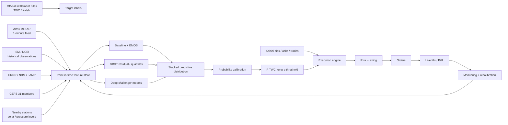
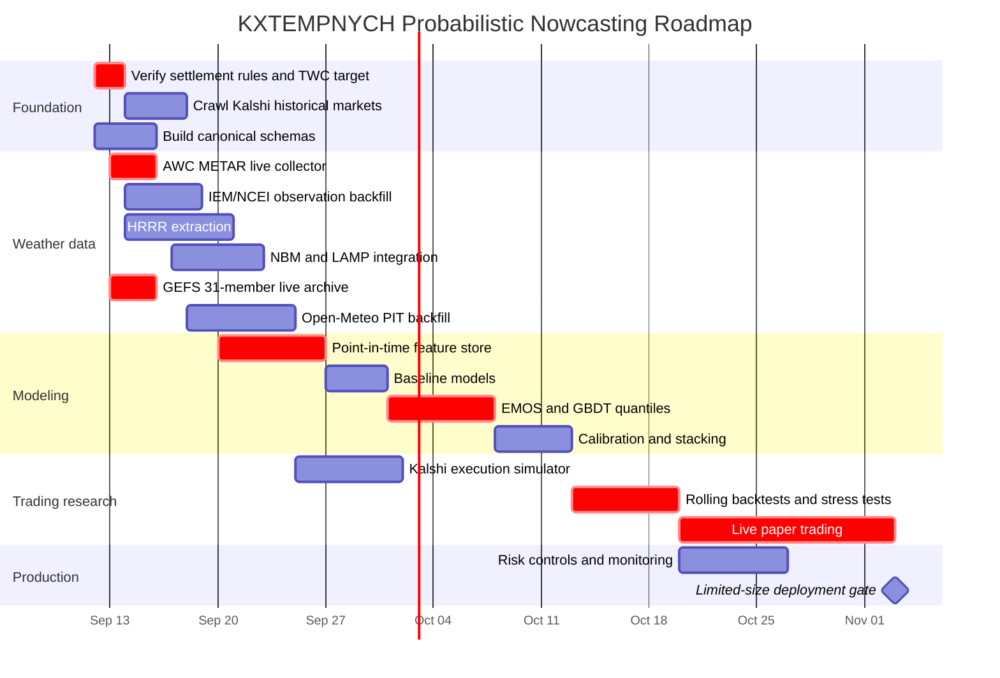

# Production-Grade Probabilistic Nowcasting and Trading System for Kalshi NYC Hourly Temperature Markets

## Executive summary

The strongest design for `KXTEMPNYCH` is **not** “train a neural network to predict NYC temperature.” It is a point-in-time probabilistic forecasting system whose target is the **exact Kalshi settlement mechanism**, whose strongest inputs are fresh observations plus operational numerical weather prediction, and whose final layer is explicitly calibrated to produce probabilities for each Kalshi threshold.

The most important finding from the research is a settlement detail that materially changes the architecture: **Kalshi hourly temperature markets settle on The Weather Company reading at the exact target time for the station coordinates specified in the market rules—not on NWS/ASOS observations.** Kalshi warns that preliminary Weather Company readings can differ from final values because of rounding/conversion, and says hourly markets generally settle about 25–35 minutes after close. Historical outcome-source readings are exposed through the Weather Company/Kalshi interface. citeturn18view1 Therefore, ASOS, HRRR, NBM, GEFS, LAMP and nearby stations are **predictors**, but the supervised target must ultimately be the TWC/Kalshi settlement value or the settled binary threshold outcome.

That distinction is central. A model that predicts an ASOS thermometer extremely well but systematically misses a TWC rounding or station-mapping convention can lose money despite excellent conventional weather scores.

The second major finding is that the public-data stack is unusually strong. NOAA's HRRR archive on AWS goes back to 2014; Open-Meteo's historical forecast archive exposes HRRR back to 2018, GFS back to March 2021, and NBM from October 2024; the Open-Meteo Single Runs interface preserves individual operational runs from April 2026 for most models; its Previous Runs product supplies fixed lead-time forecasts; and its Ensemble API exposes the **31-member, 0.25° NOAA GFS/GEFS ensemble** every six hours, with each individual member available for recent runs. Open-Meteo explicitly lists GFS Ensemble 0.25° as 31 members, roughly 25-km native resolution, three-hourly native output, ten-day horizon, updated every six hours. citeturn19view0turn20view1turn20view3

The third finding is that **GEFS raw member vote should not be treated as a calibrated probability**. Thirty-one members exceeding 80°F does not automatically make \(31^{-1}\sum I(T_i\ge80)\) a correct 80°F exceedance probability. Dynamical ensembles routinely contain systematic bias and dispersion error; EMOS and Bayesian model averaging were developed precisely to post-process such ensembles into calibrated predictive distributions. citeturn23search4turn23search11 The best first production model is therefore much simpler than a Transformer:

\[
\boxed{
\text{fresh observations}
+
\text{HRRR/NBM/LAMP forecasts}
+
\text{GEFS distribution}
\rightarrow
\text{GBDT residual model}
\rightarrow
\text{EMOS/quantile calibration}
\rightarrow
P(T_{\mathrm{TWC}}\ge K)
}
\]

For an initial profitable-system search, my model priority would be:

| Priority | Model | Why |
|---|---|---|
| **A** | Persistence / bias-corrected HRRR/NBM baselines | Establish whether anything harder adds real skill |
| **A** | EMOS on GEFS + deterministic guidance | Very cheap, naturally probabilistic, strong weather-postprocessing foundation |
| **A** | LightGBM/CatBoost residual + quantile models | Excellent tabular nonlinear learner; fast retraining; interpretable; little compute |
| **A** | Stacked EMOS + GBDT + recent-observation nowcast | Best likely public-data production candidate |
| **B** | Hierarchical Bayesian residual model | Good uncertainty/seasonality treatment, but more implementation work |
| **B** | Quantile regression forests / Gaussian processes | Useful challenger models |
| **C** | LSTM/TCN | Worth testing only after sufficient point-in-time history |
| **C** | Transformer / MDN / deep ensemble | Potentially powerful, but likely data-hungry relative to the amount of actual KXTEMPNYCH settlement history |

This priority reflects the structure of the problem, not a claim that any strategy is guaranteed profitable. `KXTEMPNYCH` has at least 1,000 archived markets in the user's availability audit, with the exact earliest date still requiring a complete cursor crawl. Historical full order books are not available in that dataset, whereas historical trades and candles can be collected. fileciteturn0file0 That is enough to begin serious research, but still modest for a high-capacity deep network.

For observations, I would upgrade the earlier plan: use the **NWS Aviation Weather Center Data API as the main low-latency public METAR feed**. Its current METAR cache updates once a minute, the API supports raw/JSON/CSV formats, permits up to 100 requests/minute, retains about 30 days in the query database, and AviationWeather.gov says observations generally appear within a minute or two after they receive them. citeturn25search0turn25search7 Use IEM/NCEI one-minute ASOS for historical model training—not live trading—because IEM explicitly says its processed one-minute NCEI archive can lag **18–36 hours or more**. citeturn20view8 NWS `api.weather.gov` is an excellent fallback, but NWS warns its station observations can be delayed up to about 20 minutes by MADIS QC. citeturn20view13

For short horizons, add **LAMP/GLMP** even though it was not in the original requested stack. NOAA's LAMP is explicitly designed as hourly-updated statistical short-range guidance, includes 2-m temperature and dew point, incorporates recent observations and model/MOS information, and forecasts temperature hourly through 38 hours; GLMP is available on a 2.5-km grid. It is unusually well matched to a 1–24-hour temperature market. citeturn22search0turn22search2turn22search5

The production objective should be a **continuous predictive distribution for the official TWC temperature**, followed by threshold integration:

\[
F_t(x)=P(T_{\mathrm{TWC,target}}\le x\mid\mathcal F_t)
\]

so that for a market “temperature \(\ge K\)”:

\[
p_{\mathrm{yes},t}
=
1-F_t(K^-).
\]

This is substantially better than training an independent classifier for every threshold, because all simultaneously traded thresholds derive from a single coherent distribution and therefore cannot produce obvious internal arbitrage such as \(P(T\ge80)<P(T\ge81)\).

The system I would build first is:

> **Fresh METAR + station-network nowcast → HRRR/NBM/LAMP/GEFS feature layer → LightGBM residual/quantile forecast + Gaussian EMOS challenger → rolling probability calibration → conservative Kalshi execution.**

Deep learning becomes a challenger only after the simpler stack has demonstrated persistent out-of-sample probability skill and enough point-in-time data have accumulated.



## Settlement target and public data foundation

Before training anything, the agent should treat the **contract definition as data**. Kalshi's Series endpoint returns `settlement_sources`, contract URLs, terms URLs, fee information and metadata, so the pipeline should fetch and version the `KXTEMPNYCH` series metadata rather than hard-coding an assumed NYC weather station. citeturn17search2 A historical KXTEMPNYCH market page confirms The Weather Company as its source, and Kalshi's own weather documentation says hourly markets settle on the TWC reading at the exact specified time and rule-specified station coordinates. citeturn15search14turn18view1

**Do not assume that Central Park, JFK, LaGuardia, Newark, or any particular METAR is the settlement instrument until the current `KXTEMPNYCH` contract terms have been parsed.** Kalshi's *daily* NYC series documentation identifies Central Park, but hourly series have distinct TWC rules. citeturn17search6

### Public-data comparison

| Source | Role | Resolution / update | Historical coverage relevant to project | Live latency | Programmatic access / limits | Cost / caveat |
|---|---|---|---|---|---|---|
| **Kalshi + TWC outcome source** | Ground-truth KXTEMPNYCH settlement | Exact contract time | Current KXTEMPNYCH archive plus TWC historical settlement interface | Settlement generally ~25–35 min after close | Kalshi REST + source page | Critical label; TWC preliminary value may differ from final due rounding/conversion. citeturn18view1 |
| **NWS Aviation Weather Center METAR** | Primary live observations | Current METAR cache once/minute | Query DB currently ~30 days | Site says typically within 1–2 min of receipt | `/api/data/metar`, JSON/raw/CSV; 100 req/min; max result limits | Public; excellent live source. citeturn25search0turn25search7 |
| **IEM one-minute ASOS** | Historical high-frequency observations | 1 minute | Some stations back to ~2000 | **Not real-time; 18–36 h+ lag** | Scriptable IEM endpoint | Free/public research source; processed “best guess.” citeturn20view8turn20view9 |
| **IEM METAR archive** | Historical/recent METAR | Routine + special reports | Long-running station archive | Archive synchronized from real-time ingest periodically; cited page says 10 min | CGI/API-like downloader | Convenient but should not be sole low-latency production feed. citeturn20view10 |
| **NCEI GHCNh** | Authoritative historical surface archive | Hourly/synoptic | Long station histories | Archive, not trading feed | Bulk PSV/Parquet | GHCNh is NCEI's replacement for ISD. citeturn20view11 |
| **NCEI LCDv2** | Climate summaries / validation | Hourly/daily/monthly summaries | Station dependent | Archive | NCEI search/bulk products | Current LCD uses GHCNh/GHCNd; old ISD-based LCDv1 stopped updating Aug. 2025. citeturn20view12 |
| **NWS API** | Backup obs + NWS forecast products | Station obs / forecast grids | Limited API history | Can be delayed ~20 min by MADIS QC | Free web API; unpublished “reasonable” rate limits | Not first-choice latency source. citeturn19view11turn20view13 |
| **HRRR direct NOAA/AWS** | High-resolution deterministic short-range NWP | ~3 km, hourly cycles | AWS archive since 2014 | Operational model latency | Public S3, no AWS account required | Best deep historical PIT NWP source; GRIB engineering required. citeturn20view7 |
| **Open-Meteo HRRR historical forecast** | Easy historical HRRR extraction | ~3 km, hourly | Listed from 2018-01-01 | API layer | JSON/CSV API | Easier than raw GRIB; distinguish stitched history from original runs. citeturn20view1 |
| **NBM v5** | Calibrated multi-model guidance | CONUS ~2.5–3 km products, frequent cycles | Open-Meteo archive from 2024-10-08 | Operational | NOAA GRIB/text; Open-Meteo abstraction | NBM v5.0 operational since May 2026; later temperature fixes make version metadata important. citeturn21search0turn21search17 |
| **LAMP / GLMP** | Very-short-range statistical guidance | Hourly; GLMP 2.5 km | NOAA operational archives vary | Designed around fresh observations | NOMADS ASCII/BUFR/GRIB2 | Temperature forecasts 1–38 h; highly relevant. citeturn22search0turn22search2 |
| **Open-Meteo GEFS 0.25°** | Probabilistic NWP | 31 members; ~25 km; 3-hour native; 6-hour cycles | Individual members only recent via Ensemble API | Near operational model availability | `/v1/ensemble` | Individual-member history only up to ~3 days through this endpoint; archive ourselves. citeturn19view0 |
| **Open-Meteo Ensemble Mean** | Historical ensemble summaries | Mean / spread | Longer than individual members; much recent coverage starts in 2026 | Operational/API | API | Useful, but insufficient substitute for member archive when training nonlinear postprocessors. citeturn19view0 |
| **Open-Meteo Historical Forecast** | Convenient operational forecast history | Model-specific | GFS from Mar. 2021, HRRR listed from 2018, NBM Oct. 2024 | N/A historical | Historical API | Stitches early portions of successive runs; not a full arbitrary-init reconstruction. citeturn20view1turn20view2 |
| **Open-Meteo Previous Runs** | Fixed-lead forecast-error training | 24h, 48h… offsets | Most models Jan. 2024; GFS 2-m temp Mar. 2021 | N/A | API | Excellent for lead-time-specific bias estimation. citeturn20view3 |
| **Open-Meteo Single Runs** | Exact model-run reconstruction | Original run horizon | Most non-ECMWF models from Apr. 2, 2026 | N/A | `run=<init>` | Correct product for faithful PIT reconstruction; init time is **not publication time**. citeturn20view2turn20view6 |

Open-Meteo should be treated as an **access layer, not the only archival source**. Its Historical Forecast product stitches the first portions of successive runs and is consequently excellent for residual climatology but does not preserve all lead times of every old run. For a precise trading backtest, direct HRRR archives or Open-Meteo Single Runs are preferable whenever available. Open-Meteo explicitly distinguishes Historical Forecast, Previous Runs and Single Runs for exactly these use cases. citeturn20view1turn20view2

There is another subtle point-in-time problem: model *initialization* is not model *availability*. Open-Meteo notes that a global model initialized at 00Z may not be publicly available until roughly 04–06Z, while regional models commonly need roughly 1–3 hours. citeturn20view6 A backtest that lets a 12:05 decision use a “12Z” HRRR/GFS run merely because its initialization timestamp is 12:00 is lookahead-biased.

### What to pull from GEFS

Open-Meteo's current ensemble interface exposes far more than `temperature_2m`. The documented fields include temperature, dew point, relative humidity, surface and sea-level pressure, low/mid/high/total cloud, wind, gusts, CAPE, CIN, solar radiation, surface temperature, soil variables, plus pressure-level temperature, moisture, wind, vertical velocity and geopotential height. citeturn19view0

For this system, archive the full 31-member vectors for:

```text
temperature_2m
dew_point_2m
relative_humidity_2m
pressure_msl
surface_pressure
cloud_cover
cloud_cover_low
cloud_cover_mid
cloud_cover_high
wind_speed_10m
wind_direction_10m
wind_gusts_10m
shortwave_radiation
direct_radiation
diffuse_radiation
cape
cin
surface_temperature

temperature_925hPa
temperature_850hPa
temperature_700hPa
geopotential_height_850hPa
geopotential_height_500hPa
relative_humidity_850hPa
wind_speed_850hPa
wind_direction_850hPa
vertical_velocity_700hPa
```

Not every variable needs to enter version one. The storage is cheap relative to the difficulty of recreating individual GEFS members later. Open-Meteo only retains individual ensemble-member history for up to roughly three days through its Ensemble API, so **archive every live pull permanently from day one**. citeturn19view0

Do not naively interpolate 3-hour GEFS temperature to the target and call that a probability. Open-Meteo itself interpolates model data to hourly API output for ease of use, while documenting that GEFS 0.25° is natively three-hourly. citeturn19view0 Preserve both the API output and metadata describing model/native resolution.

## Forecasting methods and recommended architecture

Temperature over the next few hours is unusually well suited to **hybrid physics-plus-statistics**. A numerical model handles the large-scale atmospheric evolution; observations tell us what the atmosphere is actually doing now; machine learning estimates local, lead-dependent residuals; probabilistic post-processing fixes dispersion and bias.

### Physical guidance

**HRRR** should be the primary short-horizon dynamical predictor. It is a CONUS high-resolution model whose public AWS archive goes back to 2014. citeturn20view7 It is materially finer than GEFS and therefore better positioned to describe local cloud, frontal and wind effects around NYC.

**NBM** should be treated as a strong operational baseline rather than “just another model.” NOAA describes NBM as a calibrated blend of NWS and non-NWS numerical models and post-processed guidance. Version 5.0 became operational in May 2026, with subsequent temperature/dew-point fixes—including a July change explicitly targeting anomalous values during seasonal transitions and in coastal areas. citeturn21search0turn21search1turn21search17 Version changes therefore belong in model metadata and may warrant regime indicators or training-window resets.

**GEFS** supplies flow-dependent uncertainty. Open-Meteo currently exposes NOAA's 0.25° system as **31 members**, updated every six hours. citeturn19view0 The member vector carries more information than mean and standard deviation alone: skew, multimodality, tail clustering and relationships between temperature and clouds/wind can all matter.

**LAMP/GLMP** is especially attractive. NOAA says LAMP updates most sensible-weather guidance hourly using recent observations, analyses, model information and MOS, with 2-m temperature guidance through 38 hours; GLMP provides 2.5-km gridded temperature guidance. citeturn22search0turn22search5 For an hourly market it should be a first-class feature and baseline.

### Statistical probabilistic post-processing

For an exchangeable ensemble, a Gaussian EMOS temperature model is a natural first candidate:

\[
T \mid \mathbf f
\sim
\mathcal N(\mu,\sigma^2)
\]

with

\[
\mu=a+b\bar f
\]

and

\[
\sigma^2=c+dS^2,
\]

where \(\bar f\) is ensemble mean and \(S^2\) ensemble variance. In a richer multi-model variant:

\[
\mu=
a+
b_1 f_{\mathrm{HRRR}}
+b_2 f_{\mathrm{NBM}}
+b_3 f_{\mathrm{LAMP}}
+b_4 \bar f_{\mathrm{GEFS}}
+b_5(T_{\mathrm{obs}}-f_{\mathrm{HRRR,current}}).
\]

EMOS was developed specifically to correct ensemble bias and dispersion while exploiting the spread–skill relationship, commonly estimating parameters by minimizing CRPS. citeturn23search4turn23search15

BMA instead writes the predictive density as a weighted mixture of member- or model-conditioned distributions:

\[
p(y\mid f_1,\ldots,f_M)
=
\sum_m w_m g_m(y\mid f_m),
\]

with weights representing relative predictive contributions. The original weather BMA work explicitly considered quantities such as temperature where Gaussian member-conditioned distributions are appropriate. citeturn23search11 For 31 exchangeable GEFS perturbations, fitting 31 independent model identities is usually unnecessary; exchangeable-member BMA variants were developed for exactly that situation. citeturn23search6

My preference is **EMOS before BMA** here: fewer parameters, extremely fast fitting, straightforward rolling re-estimation, and enough flexibility when combined with HRRR/NBM/LAMP predictors.

### Quantile and tree methods

Quantile regression directly estimates

\[
Q_\tau(Y\mid X)
\]

by minimizing the pinball loss:

\[
L_\tau(y,\hat q)
=
\begin{cases}
\tau(y-\hat q), & y\ge\hat q,\\
(1-\tau)(\hat q-y), & y<\hat q.
\end{cases}
\]

The modern framework traces to Koenker and Bassett's regression-quantile formulation. citeturn7search16

For this project, tree-based quantile regression is an unusually good fit because inputs are heterogeneous and interactions matter: forecast lead, hour, season, cloud change, wind direction, current-model residual, GEFS spread and station gradient interact nonlinearly.

LightGBM officially supports a `quantile` objective, while CatBoost exposes `Quantile` and `MultiQuantile` regression objectives. citeturn24search17turn24search13 Quantile regression forests provide a nonparametric alternative that estimates full conditional distributions rather than only means. citeturn7search8

I would train quantiles at:

```text
0.02
0.05
0.10
0.20
0.30
0.40
0.50
0.60
0.70
0.80
0.90
0.95
0.98
```

Then enforce non-crossing quantiles and interpolate the conditional CDF.

An even more effective approach may be **residual learning**:

\[
r =
T_{\mathrm{TWC}}
-
T_{\mathrm{base}}
\]

where `base` is HRRR, NBM, LAMP or a blend. The ML model predicts \(r\), not temperature from scratch:

\[
\hat T =
T_{\mathrm{base}}
+\hat r(X).
\]

This gives the machine learner a much easier problem and naturally survives seasonal changes better than a pure end-to-end temperature model.

### Bayesian and Gaussian-process methods

A hierarchical Bayesian residual model is attractive when the data are limited. For example:

\[
r_{d,h}
=
\alpha_h
+\beta_{\mathrm{month}}
+\gamma_{\mathrm{lead}}
+\delta_{\mathrm{regime}}
+\epsilon
\]

with partial pooling across target hours, months and forecast horizons. It can gracefully represent uncertainty in sparsely sampled combinations.

Gaussian processes provide a principled predictive distribution and can model residuals as a smooth function of lead time, solar elevation, season and current bias. Gaussian-process regression is inherently probabilistic, but exact GP training scales poorly with sample count unless sparse approximations are used. Rasmussen and Williams' standard GP treatment provides the underlying Bayesian predictive framework. citeturn10search1 For a single station and carefully aggregated hourly examples, a sparse GP is plausible; for millions of decision snapshots, GBDT is considerably easier.

### Deep learning

LSTM models were designed to capture long-range sequence dependencies and remain a reasonable sequence-model baseline. citeturn9search17 A useful architecture would encode the preceding 3–12 hours of:

```text
target-station observations
neighbor observations
HRRR forecast evolution
NBM forecast evolution
GEFS ensemble summaries
cloud / radiation / wind
```

and decode a distribution at the target timestamp.

A Temporal Convolutional Network is a strong challenger because causal dilated convolutions efficiently cover long observation windows and can be easier to train than recurrent networks; comparative work has shown generic temporal convolutional architectures can be competitive with canonical recurrent approaches on sequence modeling tasks. citeturn9search0

Transformers provide attention over long temporal/context sequences and are flexible when many exogenous model runs must be fused. citeturn9search7 But **I would not start there**. Actual TWC/KXTEMPNYCH settlement history is far smaller than the meteorological archive. A Transformer can easily spend its capacity memorizing weather regimes instead of discovering tradable residual signal.

A Mixture Density Network instead predicts mixture weights, means and variances:

\[
p(y\mid x)
=
\sum_{j=1}^{K}
\pi_j(x)
\mathcal N(y;\mu_j(x),\sigma_j^2(x)),
\]

allowing a genuinely multimodal output. Bishop introduced MDNs specifically as neural networks producing full conditional probability distributions. citeturn10search3 They become interesting when situations such as uncertain frontal passage produce two plausible temperature regimes.

Deep ensembles train several independently initialized probabilistic networks and average their predictive distributions. The original deep-ensemble work found them simple to parallelize and effective for predictive uncertainty and calibration. citeturn24search2 They are more appealing than a single neural model, but substantially more expensive than tree ensembles.

### Recommended model comparison

| Candidate | Probabilistic output | Compute | Data appetite | Main advantage | Main weakness | Priority |
|---|---:|---:|---:|---|---|---|
| Persistence / linear bias correction | Parametric residual | Tiny | Tiny | Essential benchmark | Misses nonlinear regimes | **Must build** |
| Raw GEFS member frequency | Empirical | Tiny | None | Immediate uncertainty proxy | Uncalibrated / coarse | Benchmark only |
| Gaussian EMOS | Full Gaussian | Tiny | Low | Weather-specific, interpretable, calibrated | Gaussian tail assumption | **Highest** |
| BMA | Mixture PDF | Low–medium | Low–medium | Flexible multi-model combination | More parameter/fit complexity | Challenger |
| GBDT mean residual | Point + separate residual PDF | Low | Medium | Excellent nonlinear tabular skill | Distribution needs separate layer | **Highest** |
| GBDT quantiles | Quantiles/CDF | Low | Medium | Direct heteroskedastic uncertainty | Quantile crossing/tail sparsity | **Highest** |
| Quantile RF | Conditional empirical distribution | Medium | Medium | Nonparametric | Larger/slower | Challenger |
| Hierarchical Bayesian | Full posterior | Medium | Low | Partial pooling, uncertainty | Modeling/compute complexity | Strong challenger |
| Sparse GP | Full posterior | Medium | Medium | Smooth uncertainty | Scaling | Niche |
| LSTM / TCN | Parametric/quantiles | Medium | High | Uses temporal sequences directly | More data/ops complexity | Later |
| Transformer | Parametric/quantiles | High | Very high | Powerful multimodal fusion | Likely overkill initially | Later |
| MDN deep ensemble | Flexible mixture | High | High | Rich multimodal uncertainty | Harder calibration/debugging | Research |

**The system most likely to earn its complexity budget is EMOS + quantile GBDT + a small stacking layer.** That combines a meteorologically principled distribution with flexible local residual correction without requiring GPUs.

## Point-in-time dataset and feature engineering

The dataset has to answer one question exactly:

> **At decision timestamp \(t\), what was actually knowable before the KXTEMPNYCH target timestamp \(T\)?**

The distinction between `init_ts`, `valid_ts`, `published_ts`, and `ingested_ts` is therefore mandatory.

### Core schemas

```sql
CREATE TABLE weather_location (
    location_id          TEXT PRIMARY KEY,
    name                 TEXT NOT NULL,
    source_station_id    TEXT,
    latitude             DOUBLE PRECISION NOT NULL,
    longitude            DOUBLE PRECISION NOT NULL,
    elevation_m          DOUBLE PRECISION,
    timezone             TEXT NOT NULL,
    location_role        TEXT NOT NULL, -- settlement, neighbor, grid_point
    effective_from       TIMESTAMPTZ,
    effective_to         TIMESTAMPTZ
);

CREATE TABLE kalshi_contract (
    market_ticker        TEXT PRIMARY KEY,
    event_ticker         TEXT NOT NULL,
    series_ticker        TEXT NOT NULL,
    target_ts_utc        TIMESTAMPTZ NOT NULL,
    target_ts_local      TIMESTAMP NOT NULL,
    comparator           TEXT NOT NULL, -- >=, >, <=, <
    threshold_f          DOUBLE PRECISION NOT NULL,
    settlement_source    TEXT NOT NULL,
    settlement_location  TEXT,
    open_ts              TIMESTAMPTZ,
    close_ts             TIMESTAMPTZ,
    settled_ts           TIMESTAMPTZ,
    result               BOOLEAN,
    rules_hash           TEXT NOT NULL,
    raw_metadata_json    JSONB NOT NULL
);

CREATE TABLE settlement_temperature (
    target_ts_utc        TIMESTAMPTZ NOT NULL,
    location_id          TEXT NOT NULL,
    official_temp_f      DOUBLE PRECISION,
    source               TEXT NOT NULL, -- TWC
    is_final             BOOLEAN NOT NULL,
    retrieved_at         TIMESTAMPTZ NOT NULL,
    raw_hash             TEXT,
    PRIMARY KEY(target_ts_utc, location_id, retrieved_at)
);

CREATE TABLE surface_observation (
    station_id           TEXT NOT NULL,
    valid_ts             TIMESTAMPTZ NOT NULL,
    received_ts          TIMESTAMPTZ,
    source               TEXT NOT NULL,
    temp_c               DOUBLE PRECISION,
    dewpoint_c           DOUBLE PRECISION,
    wind_speed_ms        DOUBLE PRECISION,
    wind_dir_deg         DOUBLE PRECISION,
    gust_ms              DOUBLE PRECISION,
    pressure_hpa         DOUBLE PRECISION,
    visibility_m         DOUBLE PRECISION,
    cloud_base_m         DOUBLE PRECISION,
    cloud_fraction       TEXT,
    precip_mm            DOUBLE PRECISION,
    qc_flags             TEXT,
    raw_metar            TEXT,
    raw_payload_hash     TEXT,
    PRIMARY KEY(station_id, valid_ts, source)
);

CREATE TABLE model_run (
    model_run_id         BIGINT PRIMARY KEY,
    provider             TEXT NOT NULL,
    model                TEXT NOT NULL,
    model_version        TEXT,
    init_ts              TIMESTAMPTZ NOT NULL,
    published_ts         TIMESTAMPTZ,
    published_ts_method  TEXT, -- observed / conservative_estimate
    ingested_ts          TIMESTAMPTZ NOT NULL,
    grid_resolution_km   DOUBLE PRECISION,
    raw_manifest_uri     TEXT NOT NULL
);

CREATE TABLE model_forecast (
    model_run_id         BIGINT NOT NULL,
    location_id          TEXT NOT NULL,
    valid_ts             TIMESTAMPTZ NOT NULL,
    lead_minutes         INTEGER NOT NULL,
    member_id            INTEGER, -- null deterministic
    variable             TEXT NOT NULL,
    level_hpa            INTEGER,
    value                DOUBLE PRECISION NOT NULL,
    unit                 TEXT NOT NULL,
    PRIMARY KEY(
        model_run_id, location_id, valid_ts,
        member_id, variable, level_hpa
    )
);
```

Market-data tables:

```sql
CREATE TABLE kalshi_trade (
    market_ticker        TEXT NOT NULL,
    trade_ts             TIMESTAMPTZ NOT NULL,
    trade_id             TEXT,
    yes_price            NUMERIC(8,4),
    quantity             NUMERIC(18,4),
    taker_side           TEXT,
    ingested_ts          TIMESTAMPTZ NOT NULL
);

CREATE TABLE kalshi_candle_1m (
    market_ticker        TEXT NOT NULL,
    period_end_ts        TIMESTAMPTZ NOT NULL,
    yes_bid_open         NUMERIC(8,4),
    yes_bid_high         NUMERIC(8,4),
    yes_bid_low          NUMERIC(8,4),
    yes_bid_close        NUMERIC(8,4),
    yes_ask_open         NUMERIC(8,4),
    yes_ask_high         NUMERIC(8,4),
    yes_ask_low          NUMERIC(8,4),
    yes_ask_close        NUMERIC(8,4),
    price_open           NUMERIC(8,4),
    price_high           NUMERIC(8,4),
    price_low            NUMERIC(8,4),
    price_close          NUMERIC(8,4),
    volume               NUMERIC(18,4),
    open_interest        NUMERIC(18,4),
    PRIMARY KEY(market_ticker, period_end_ts)
);

CREATE TABLE orderbook_event_live (
    receive_ts           TIMESTAMPTZ NOT NULL,
    exchange_ts          TIMESTAMPTZ,
    market_ticker        TEXT NOT NULL,
    sequence_no          BIGINT NOT NULL,
    event_type           TEXT NOT NULL, -- snapshot/delta
    side                 TEXT,
    yes_price            NUMERIC(8,4),
    quantity_delta       NUMERIC(18,4),
    PRIMARY KEY(market_ticker, sequence_no)
);
```

Kalshi exposes one-minute, hourly and daily candlesticks; candle records include bid, ask, price, volume and open-interest fields. citeturn17search5 For future exact execution research, archive its WebSocket order-book snapshot/delta stream. Historical full books cannot be recovered merely from trades and candles, consistent with the user's current data audit. fileciteturn0file0

### Point-in-time feature record

```sql
CREATE TABLE decision_features (
    market_ticker            TEXT NOT NULL,
    decision_ts              TIMESTAMPTZ NOT NULL,
    target_ts                TIMESTAMPTZ NOT NULL,
    horizon_minutes          INTEGER NOT NULL,

    -- freshest target/neighbor observations
    temp_now_f               DOUBLE PRECISION,
    obs_age_seconds          INTEGER,
    dewpoint_now_f           DOUBLE PRECISION,
    pressure_now_hpa         DOUBLE PRECISION,
    wind_speed_now_ms        DOUBLE PRECISION,
    wind_dir_now_deg         DOUBLE PRECISION,

    -- intraday state
    running_max_f            DOUBLE PRECISION,
    running_min_f            DOUBLE PRECISION,
    temp_delta_5m            DOUBLE PRECISION,
    temp_delta_15m           DOUBLE PRECISION,
    temp_delta_30m           DOUBLE PRECISION,
    temp_delta_60m           DOUBLE PRECISION,
    temp_accel_15_60m        DOUBLE PRECISION,

    -- solar
    solar_elevation_deg      DOUBLE PRECISION,
    solar_azimuth_deg        DOUBLE PRECISION,
    minutes_since_sunrise    INTEGER,
    minutes_until_sunset     INTEGER,
    clear_sky_radiation      DOUBLE PRECISION,

    -- NWP
    hrrr_temp_target_f       DOUBLE PRECISION,
    hrrr_lead_minutes        INTEGER,
    hrrr_current_bias_f      DOUBLE PRECISION,
    nbm_temp_target_f        DOUBLE PRECISION,
    lamp_temp_target_f       DOUBLE PRECISION,

    -- GEFS
    gefs_mean_f              DOUBLE PRECISION,
    gefs_std_f               DOUBLE PRECISION,
    gefs_min_f               DOUBLE PRECISION,
    gefs_max_f               DOUBLE PRECISION,
    gefs_q05_f               DOUBLE PRECISION,
    gefs_q10_f               DOUBLE PRECISION,
    gefs_q25_f               DOUBLE PRECISION,
    gefs_q50_f               DOUBLE PRECISION,
    gefs_q75_f               DOUBLE PRECISION,
    gefs_q90_f               DOUBLE PRECISION,
    gefs_q95_f               DOUBLE PRECISION,

    -- regime
    cape                     DOUBLE PRECISION,
    cin                      DOUBLE PRECISION,
    temp_925_f               DOUBLE PRECISION,
    temp_850_f               DOUBLE PRECISION,
    height_500m              DOUBLE PRECISION,

    feature_version          TEXT NOT NULL,
    created_ts               TIMESTAMPTZ NOT NULL,

    PRIMARY KEY(market_ticker, decision_ts, feature_version)
);
```

### High-value feature families

**Observation assimilation.** The most important short-horizon feature is often not the model forecast itself, but today's model error:

\[
e_{m,t}=T_{\mathrm{obs},t}-F_{m,t}.
\]

Create:

\[
e_{\mathrm{HRRR}},\;
e_{\mathrm{NBM}},\;
e_{\mathrm{LAMP}},\;
e_{\mathrm{GEFSmean}}
\]

at the latest observed timestamp, plus their 15/30/60/180-minute trajectories. If HRRR is running 1.5°F cold now and the atmospheric regime has not changed, its target-time forecast should not enter the model uncorrected.

**Dynamic temperature trend.** Include robust slopes rather than only raw differences: OLS/Theil–Sen slope over 10, 20, 30, 60, 120 minutes, acceleration, deviation from today's smoothed diurnal trajectory, and time since the latest local extremum.

**Solar state.** Use actual solar elevation rather than merely local hour. Temperature at 16:00 EDT means very different things in May and October. Include sunrise/sunset, solar elevation/azimuth, clear-sky radiation and observed/model shortwave radiation.

**Spatial gradients.** After the official settlement coordinate is verified, automatically discover nearby observing stations from official station metadata. Features should include distance and bearing, upwind/downwind classification, target-minus-neighbor temperature, neighbor temperature trend, pressure gradient, wind shift timing and cloud transitions. This lets the model recognize an approaching sea-breeze/front before it appears at the settlement location.

**GEFS member features.** Preserve the raw vector \(f_1,\ldots,f_{31}\), but also compute:

\[
\bar f,\quad
s,\quad
q_{0.05},\ldots,q_{0.95},
\]

skewness, IQR, range and threshold exceedance counts.

For threshold \(K\):

\[
p_{\text{raw,GEFS}}(K)
=
\frac{1}{31}
\sum_{i=1}^{31}
I(f_i\ge K).
\]

That value is a **feature**, not the final probability.

Additional useful values:

```text
members_above_K
members_above_K_minus_1F
members_above_K_plus_1F
distance_of_mean_to_threshold
distance_of_median_to_threshold
threshold_inside_ensemble_range
member_density_within_0.5F_of_threshold
member_density_within_1.0F_of_threshold
```

The density around the strike is especially important because a 0.3°F model adjustment matters far more when many members straddle the contract threshold.

**Pressure-level regime indicators.** For NYC, use 925/850-hPa temperature as measures of air-mass thermal state, lower-tropospheric lapse relationships, 850-hPa wind direction, 500-hPa heights, RH at 850/700 hPa and vertical velocity. These are available through Open-Meteo's ensemble interface. citeturn19view0

**Convective/cloud risk.** CAPE, CIN, precipitation, cloud layers and shortwave radiation help identify days where deterministic temperature trajectories are likely to bust. Open-Meteo exposes CAPE/CIN as well as solar-radiation variables. citeturn19view0

**METAR remarks.** Preserve raw METAR/SPECI text even when parsing only part of it today. NOAA aviation documentation confirms METAR contains wind, visibility, weather, sky condition, temperature, dew point and altimeter information. citeturn25search1 For ASOS remarks, parse precise `T` groups and relevant max/min or precipitation groups whenever present.

### The anti-lookahead join

Never implement:

```python
forecast = forecasts[
    forecasts.init_ts <= decision_ts
].latest()
```

The correct selection is:

```python
eligible = forecasts[
    forecasts.available_ts <= decision_ts
]

run = eligible.sort_values("available_ts").iloc[-1]
```

where `available_ts` is either an observed publication/ingestion timestamp or a deliberately conservative reconstruction.

Likewise:

```python
assert obs.received_ts <= decision_ts
assert model.available_ts <= decision_ts
assert candle.period_end_ts <= decision_ts
```

For live feeds, store the **local receipt timestamp** permanently. That later becomes the empirical distribution of source latency needed to make historical assumptions realistic.

## Training, calibration, validation and robustness

The correct target is a distribution, so ordinary RMSE is not sufficient. A model can have excellent RMSE and still systematically assign 70% probabilities to events occurring 55% of the time—a serious trading defect.

### Training ladder

The first training round should build models in increasing complexity:

**Baseline zero** — climatology by target hour, day-of-year and lead.

**Baseline one** — persistence / linear extrapolation:

\[
\hat T_T = T_t + \beta_h(T_t-T_{t-\Delta}).
\]

**Baseline two** — raw HRRR, NBM, LAMP and GEFS mean.

**Baseline three** — dynamically bias-corrected NWP:

\[
\hat T_T =
F_{m,T} + \hat \rho_h (T_t-F_{m,t}).
\]

**Candidate A** — EMOS.

**Candidate B** — LightGBM/CatBoost median residual model plus empirical residual distribution.

**Candidate C** — multi-quantile GBDT.

**Candidate D** — stack A/B/C with a small regularized linear/logistic meta-model.

Only after those are frozen should LSTM/TCN/Transformer/MDN challengers be trained.

### Probabilistic losses

For continuous distributions, use **CRPS** as the principal model-selection criterion:

\[
\text{CRPS}(F,y)
=
\int_{-\infty}^{\infty}
(F(x)-\mathbf 1\{y\le x\})^2dx.
\]

CRPS is closely connected to threshold-event Brier scores and assesses the whole predictive CDF rather than a single quantile. citeturn11search13 The broader proper-scoring-rule literature establishes why truthful probabilistic forecasts should be evaluated with proper scores rather than accuracy alone. citeturn11search11

For each Kalshi threshold, calculate the Brier score:

\[
BS=\frac1N\sum_i(p_i-y_i)^2,
\]

whose original formulation was introduced for probabilistic forecasts. citeturn11search1

Also calculate log loss:

\[
LL
=
-\frac1N\sum_i
[y_i\log p_i+(1-y_i)\log(1-p_i)].
\]

Log score heavily penalizes catastrophic overconfidence—which is exactly the failure mode that can destroy a trading bankroll.

For quantile models, use mean pinball loss by quantile and interval coverage.

### Metric table

| Metric | What it tests | Why it matters for trading |
|---|---|---|
| MAE / RMSE | Point forecast accuracy | Basic sanity check; not sufficient |
| CRPS | Full distribution quality | Primary weather-distribution metric |
| Brier score | Binary threshold probability accuracy | Directly aligned with Kalshi contracts |
| Log score | Probabilistic accuracy; punishes overconfidence | Critical risk metric |
| Reliability / ECE | Calibration | Tests whether quoted 70% events happen ~70% |
| Sharpness | Concentration of forecasts | Prefer narrow distributions subject to calibration |
| Interval coverage | Quantile validity | Checks tails |
| PIT histogram | Continuous-distribution calibration | Reveals bias/dispersion |
| Ensemble rank histogram | Raw ensemble calibration | Diagnoses under/overdispersion and bias |
| Realized edge vs predicted edge | Economic calibration | Most important after costs |
| P&L / drawdown / Sharpe | Trading outcome | Final rather than meteorological objective |

Gneiting and coauthors formalized the principle of maximizing **sharpness subject to calibration** for probabilistic forecasts. citeturn7search10 Rank histograms are useful ensemble diagnostics, but a flat histogram alone is not sufficient proof of a good ensemble. citeturn11search0

### Probability calibration

There are two calibration problems:

1. calibrate the **temperature distribution**;
2. calibrate the resulting **binary strike probabilities**.

Prefer fixing level one first with EMOS, quantile mapping or residual-distribution correction. Then binary post-calibration should be light.

For binary probabilities:

**Platt/logistic calibration**

\[
p'=\sigma(a\,\text{logit}(p)+b)
\]

is low variance and suitable for small samples.

**Isotonic regression** is flexible and monotone but needs considerably more observations; calibration literature notes its tendency to overfit smaller datasets. citeturn24search12

**Beta calibration** uses a richer transformation of \(p\) and \(1-p\); Kull, Silva Filho and Flach proposed it as a flexible alternative to standard logistic calibration, particularly when score distributions are asymmetric. citeturn24search14

For deep networks, temperature scaling is an especially simple post-hoc challenger; modern neural calibration work found simple temperature scaling remarkably effective in several settings. citeturn8search2

For this project I would use:

```text
Small sample:
    Platt / beta calibration

Medium sample:
    beta + isotonic challengers

Continuous model:
    EMOS / quantile recalibration first
```

Do not fit calibrators using the same rows that trained the base model. Each rolling training fold needs a later internal calibration block.

### Rolling-origin validation

A valid split resembles:

```text
Train ────────────────┐
                      │
Calibration ──────────┤
                      │
Test                   ▼

Jan-Apr  -> May -> June
Feb-May  -> Jun -> July
Mar-Jun  -> Jul -> August
...
```

Never random-shuffle weather snapshots. Snapshots from the same target event are extremely correlated and must remain in the same fold.

The outer unit is the **target timestamp/event**, not the individual five-minute feature row.

A reasonable scheme:

```text
training lookback:   180-730 days depending on model
calibration window:   30-60 days
test window:          14-30 days
roll step:             7-14 days
```

Compare both expanding and rolling windows. Rolling windows adapt to model-version and seasonal changes; expanding windows reduce estimation noise.

For NBM specifically, record model version/change dates because operational changes can alter forecast-error distributions. NOAA's 2026 temperature fixes illustrate why an apparently stationary residual process may not actually be stationary. citeturn21search2turn21search17

### Robustness tests

The following should be explicit go/no-go tests rather than optional visualizations:

| Stress | Test |
|---|---|
| Observation outage | No target-station observation for 5/15/30/60 min |
| Delayed feed | Add 2/5/10/20 min artificial receipt delays |
| NWP late arrival | Delay newest HRRR/NBM/GEFS cycle |
| Incorrect “new” run assumption | Force conservative model-publication lags |
| Cloud surprise | Evaluate high forecast-cloud-error days separately |
| Frontal passage | High 3h pressure/temp gradient subset |
| Convection | CAPE/CIN/precip regime subset |
| Coastal regime | Onshore vs offshore wind partitions |
| Season transition | Mar–May and Sep–Nov subsets |
| Threshold proximity | Cases within ±0.25/0.5/1/2°F |
| Extreme probability | Predictions <10% and >90% |
| TWC-vs-ASOS discrepancy | Distribution of final TWC minus best matching station |
| Market stress | Wide spread / low volume / sudden quote jump |
| Calibration shock | Artificial probability bias ±1/2/3/5 percentage points |

The last one is especially important. A model can appear highly profitable if an 8-point “edge” is really a 5-point calibration bias plus 3 points of spread/fees.

## Trading and backtesting design

The prediction system should produce a coherent CDF \(F_t(x)\). Each simultaneous Kalshi threshold is then merely a derivative of that CDF.

For a contract resolving YES when \(T\ge K\):

\[
p_{\text{fair}}
=
P(T\ge K)
=
1-F(K^-).
\]

For a YES ask \(a\), the gross expected value of buying one $1-paying binary contract and holding to settlement is:

\[
EV_{\text{gross}}
=
p(1-a)-(1-p)a
=
p-a.
\]

The real expression is:

\[
EV_{\text{net}}
=
p
-
a
-
C_{\text{fee}}
-
C_{\text{slippage}}
-
C_{\text{model-risk}}.
\]

The final term is deliberate. A 54% model probability versus a 50¢ ask is not a genuine four-point opportunity if the model's out-of-sample calibration uncertainty is ±5 points.

### Trading trigger

A production rule should be closer to:

\[
p_{\text{model}}-a
>
\text{fees}
+\text{expected slippage}
+\text{calibration uncertainty}
+\text{safety margin}.
\]

Example:

```text
model calibrated probability     0.641
YES ask                          0.565
raw edge                         0.076

estimated fees                   0.010
expected slippage                0.006
95% calibration-error reserve    0.025
safety reserve                   0.010

tradable adjusted edge           0.025
```

This is much safer than “trade any >5% model/market difference.”

Trade both sides symmetrically:

\[
EV_{\mathrm{YES}}=p-a_{\mathrm{YES}}-\text{costs}
\]

\[
EV_{\mathrm{NO}}=(1-p)-a_{\mathrm{NO}}-\text{costs}.
\]

Never substitute `1 - YES bid` blindly without normalizing Kalshi's binary book representation correctly.

### Sizing

Kelly sizing is theoretically appropriate for repeated positive-EV binary bets, but full Kelly is far too sensitive to probability error for a young weather model.

For a YES contract purchased at \(c\), with \(p>c\), the simple binary-bet Kelly fraction of bankroll *staked* can be expressed as:

\[
f^*=\frac{p-c}{1-c},
\]

under idealized assumptions of independent bets, no fees, known probabilities and settlement-only exits.

Production should instead use **0.1–0.25 Kelly or less**, followed by hard caps:

```text
max loss per contract event
max total NYC weather exposure
max correlated exposure across neighboring target hours
max position at one threshold
max % of displayed depth consumed
max daily drawdown
max weekly drawdown
kill switch after data/model anomaly
```

Consecutive hourly NYC contracts are highly correlated, so treating each as an independent Kelly bet would materially overstate safe leverage.

### Execution

Separate signals into:

**Taker signal:** adjusted edge remains sufficiently large after crossing the spread.

**Maker signal:** fair price permits a resting limit order with attractive adverse-selection-adjusted EV.

Maker backtests should not claim realistic historical fills without full order-book/queue data. Your existing audit correctly notes that historical full book snapshots are unavailable in the public historical dataset you have, whereas future exact books can be collected live. fileciteturn0file0

For live operation, subscribe to WebSocket order-book snapshots and deltas and persist sequence numbers. The historical research set should use trades and one-minute bid/ask candles; Kalshi's candle API includes YES bid and ask OHLC fields as well as traded-price OHLC, volume and open interest. citeturn17search5

### Conservative historical execution simulator

Use three fill scenarios.

**Conservative taker**

```python
decision = signal_time

# Information at decision may use only fully closed candle.
quote = candle_at_or_before(decision)

# Execution is modeled after the signal.
execution_candle = first_candle_after(decision)

fill_price = execution_candle.yes_ask_high
fill_price += modeled_fee
```

**Base taker**

```python
fill_price = next_observable_ask_or_trade_based_proxy
fill_price += modeled_fee
fill_price += empirical_live_slippage_model(size)
```

**Optimistic diagnostic**

```python
fill_price = next_candle.yes_ask_open
```

The optimistic result must never be the headline strategy performance.

Once live order books have accumulated, learn:

\[
\text{slippage}
=
g(
\text{order size},
\text{depth},
\text{spread},
\text{volatility},
\text{time-to-target},
\text{quote imbalance}
)
\]

and use that historical model to improve simulations.

### Trading evaluation

Report both meteorological and financial results.

```text
net P&L
return on deployed capital
return on maximum possible loss
Sharpe / Sortino
maximum drawdown
Calmar ratio
number of bets
win rate
mean predicted edge
realized edge
P&L per contract
P&L per $ volume
fees / gross edge
slippage / gross edge
fill rate
turnover
time in position
capacity by market depth
```

Break those down by:

```text
forecast horizon
target hour
season
threshold distance
probability bucket
model regime
liquidity bucket
maker/taker
YES/NO
```

A model whose profit comes entirely from two low-liquidity events is not production-ready.

The strongest economic calibration diagnostic is:

\[
\text{realized YES rate}
-
\text{average purchase probability/price}
\]

by predicted-edge bin.

For example:

| Predicted net edge | N | Model avg p | Outcome rate | Realized probability edge |
|---:|---:|---:|---:|---:|
| 2–4 pp | ... | ... | ... | ... |
| 4–6 pp | ... | ... | ... | ... |
| 6–10 pp | ... | ... | ... | ... |
| >10 pp | ... | ... | ... | ... |

If realized edge does not rise monotonically with predicted edge, do not increase size.

## Production engineering and operational design

The architecture should distinguish immutable raw data, normalized data, features, predictions and trading state.

```text
data/
├── raw/
│   ├── kalshi/
│   ├── twc_settlement/
│   ├── awc_metar/
│   ├── iem_asos_1min/
│   ├── ncei/
│   ├── hrrr/
│   ├── nbm/
│   ├── lamp/
│   └── open_meteo/
│       ├── gefs_members/
│       ├── historical_forecast/
│       ├── previous_runs/
│       └── single_runs/
│
├── normalized/
│   ├── observations/
│   ├── model_runs/
│   ├── model_forecasts/
│   ├── contracts/
│   └── market_data/
│
├── features/
│   └── feature_version=*/
│
├── predictions/
│   └── model_version=*/
│
└── backtests/
    └── experiment_id=*/
```

Use Parquet for immutable research tables, partitioned sensibly:

```text
source=model/date=YYYY-MM-DD/
station=.../year=YYYY/month=MM/
model=HRRR/init_date=YYYY-MM-DD/
series=KXTEMPNYCH/event_date=YYYY-MM-DD/
```

Use PostgreSQL/DuckDB for metadata and analysis indexes; object storage or local compressed files for raw payloads.

### Live schedules

Recommended cadence:

| Job | Cadence |
|---|---:|
| Kalshi active-contract discovery | 1 min |
| Kalshi order-book WebSocket | continuous |
| Kalshi trades WebSocket/API | continuous |
| AWC current METAR | 1 min |
| Nearby METAR stations | 1 min |
| Open-Meteo forecast freshness check | 5 min |
| HRRR run detector | 2–5 min |
| NBM run detector | 5 min |
| LAMP run detector | 5 min |
| GEFS run detector | 5–10 min around expected cycles |
| Feature regeneration | observation/model event + every 1 min |
| Probability inference | every new material weather/market event; otherwise 1 min |
| Risk recomputation | every quote/position change |
| TWC final-settlement archive | post-settlement and retry until final |
| Daily data QC | daily |
| Fast recalibration | daily/weekly depending sample |
| Full model challenger retrain | weekly |
| Long-horizon hyperparameter review | monthly |

GEFS does **not** need to be repeatedly downloaded unchanged. Detect its new six-hour run, pull once, archive every member, and derive all threshold features locally. Open-Meteo explicitly identifies GFS Ensemble 0.25° as six-hourly. citeturn19view0

### Latency goals

There is little reason for microsecond infrastructure; weather observations and NWP updates operate on minute/hour scales.

A sensible goal is:

```text
METAR published -> ingestion          < 5 sec after API visibility
ingestion -> updated features         < 2 sec
features -> model inference           < 1 sec
quote change -> risk/signal           < 250 ms
signal -> order submission            < 250 ms
```

The market-data/execution path should be faster than the weather path because prices can change immediately after a weather update.

### Compute and cost

For one city, none of the recommended first-wave models requires expensive hardware.

Approximate engineering budgets, **not vendor quotes**:

| Deployment | Compute profile | Approx. monthly infra |
|---|---|---:|
| Research MVP | 4–8 CPU cores, 16–32 GB RAM, local NVMe | **$0–$50** if local / inexpensive VM |
| Robust production | 4–8 vCPU service + managed DB/object storage + monitoring | **~$50–$200** |
| Heavy raw GRIB + many cities | Larger storage/bandwidth/CPU | **~$150–$500+** |
| Frequent deep-learning research | Occasional GPU | **~$200–$1,000+**, depending usage |

The much bigger avoidable cost is downloading entire HRRR domains when only a tiny geographic subset/variable set is necessary. The NOAA HRRR archive is public and does not require an AWS account. citeturn20view7 Use GRIB indexes/range retrieval or a service such as Open-Meteo to avoid hauling irrelevant fields.

For Open-Meteo, note the licensing boundary: its documentation explicitly distinguishes non-commercial, commercial and self-hosted usage, and its commercial API uses customer resources/API keys. A live money-making trading deployment should review and comply with those terms rather than assuming the public non-commercial endpoint can be used indefinitely. citeturn19view0

### Monitoring

Dashboard these in production:

```text
weather feed age
target-station feed age
neighbor feed age
latest HRRR run
latest NBM run
latest LAMP run
latest GEFS run

model prediction
calibrated prediction
ensemble spread
model disagreement

Kalshi bid / ask
spread
depth
position
unrealized expected value

rolling Brier
rolling log loss
rolling CRPS
rolling calibration error
rolling TWC-vs-ASOS difference

daily P&L
drawdown
fees
slippage
```

Automatic trading should disable itself when:

```text
settlement rules changed
target station cannot be verified
weather observation is stale
critical model feeds are stale
probability pipeline produces inconsistent thresholds
clock drift exceeds tolerance
order-book sequence gap is unresolved
calibration drift exceeds limit
daily drawdown limit is hit
```

Every prediction should be reproducible from an immutable manifest containing:

```json
{
  "decision_ts": "...",
  "feature_version": "...",
  "model_version": "...",
  "calibrator_version": "...",
  "source_run_ids": ["..."],
  "observation_ids": ["..."],
  "rules_hash": "...",
  "code_commit": "...",
  "prediction": 0.6371
}
```

## Concrete agent build instructions and roadmap

The following is the implementation brief I would hand directly to an engineering/research agent.

> **Primary objective:** Build a production-quality, point-in-time probabilistic nowcasting research pipeline for Kalshi series `KXTEMPNYCH`. The target is the official The Weather Company temperature used by Kalshi at each contract's exact target timestamp and rule-specified station coordinates. Do not silently substitute ASOS/NWS temperature as the label. Kalshi explicitly states that hourly markets use TWC and that final TWC values may differ from preliminary values because of rounding/conversion. citeturn18view1

**Start by resolving the contract.**

Call:

```http
GET /trade-api/v2/series/KXTEMPNYCH
```

and persist the full response. The Kalshi Series endpoint exposes settlement sources and contract/terms metadata. citeturn17search2

Then enumerate all active and historical events/markets. Parse, do not infer from ticker alone:

```text
target date
target local timestamp
target UTC timestamp
threshold
comparison operator
settlement source
settlement coordinate/station
open
close
settlement time
result
rules/version hash
```

Complete the cursor crawl of KXTEMPNYCH history. The existing audit already finds at least 1,000 archived KXTEMPNYCH markets and notes that the true oldest date is not yet established. fileciteturn0file0

Persist TWC outcome-source readings from the public Kalshi-linked historical interface where permitted. Retain raw source payload/page, retrieval timestamp and hash. When exact final TWC temperature cannot be obtained, retain Kalshi's settled binary contract as the authoritative label and mark continuous temperature `NULL`; never synthesize it from ASOS.

**Build the live observation collector.**

Primary public feed: NWS Aviation Weather Center Data API.

Example pattern documented by AWC:

```text
/api/data/metar?ids=<ICAO>&format=json
```

AWC supports JSON/raw/CSV and limits traffic to 100 requests/minute; its current METAR cache updates once a minute. citeturn25search0

Once the contract coordinate is known:

1. identify the corresponding/nearest official station;
2. identify 5–15 surrounding stations within approximately 100 km;
3. retain distance, bearing and elevation;
4. poll relevant METARs once per minute;
5. store raw and decoded data;
6. record `valid_ts` and **local `received_ts`** separately.

Never use NWS `api.weather.gov` as the only low-latency observation source because NWS documents potential ~20-minute observation delay from upstream MADIS QC. citeturn20view13

**Backfill surface observations.**

Use IEM/NCEI one-minute ASOS where available. IEM says some one-minute stations extend to 2000 but warns that this dataset is delayed 18–36 hours or more and is not realtime. citeturn20view8

Use NCEI GHCNh/LCDv2 for authoritative long-term station validation. Do not build new code around “ISD is the current NOAA hourly archive”: NCEI states GHCNh has replaced ISD, and LCDv2 now draws its hourly records from GHCNh. citeturn20view11turn20view12

**Build the HRRR pipeline.**

Use the public NOAA HRRR AWS archive for deep point-in-time training; the archive dates to 2014 and is readable without an AWS account. citeturn20view7

Extract only relevant grid points/fields:

```text
TMP:2 m
DPT:2 m
UGRD/VGRD:10 m
GUST
TCDC and cloud layers
PRES / PRMSL
DSWRF / radiation
CAPE
CIN
precipitation
925/850/700-hPa temperature
850-hPa wind
500-hPa geopotential height
```

Store the original run:

```text
model=HRRR
init_ts
file/object key
forecast_hour
valid_ts
grid point
field
value
ingested_ts
```

For recent research where convenience matters, Open-Meteo lists historical HRRR coverage from 2018. citeturn20view1 Validate a sample against direct NOAA GRIB before relying on it.

**Build the NBM pipeline.**

Collect 2-m temperature/dewpoint and relevant uncertainty/percentile products from official NOAA NBM v5 output or Open-Meteo. NOAA describes NBM as calibrated blended guidance; v5.0 is the current operational family in 2026. citeturn21search0turn21search1

Version every run. Do not pool forecasts blindly across operational model upgrades.

**Add LAMP/GLMP.**

This is required as a challenger/baseline because NOAA LAMP uses recent observations and numerical/model-output-statistics guidance and issues hourly temperature through 38 hours. citeturn22search5

NOAA documents NOMADS filenames for station and gridded LAMP; GLMP temperature forecasts are available in GRIB2. citeturn22search2

Extract:

```text
TMP
DPT
WDR
WSP
WGS
SKY
P01
```

**Build the GEFS 31-member archive.**

Query Open-Meteo:

```text
https://ensemble-api.open-meteo.com/v1/ensemble
```

with the settlement coordinates, model set to GFS Ensemble 0.25°, and the required variables. Open-Meteo documents that model as **31 members**, ~25 km native resolution, three-hourly native resolution, ten-day forecast and six-hour update cycle. citeturn19view0

Conceptual request:

```python
params = {
    "latitude": settlement_lat,
    "longitude": settlement_lon,
    "models": "gfs_seamless",  # verify current API identifier dynamically
    "hourly": ",".join([
        "temperature_2m",
        "dew_point_2m",
        "relative_humidity_2m",
        "pressure_msl",
        "cloud_cover",
        "cloud_cover_low",
        "cloud_cover_mid",
        "cloud_cover_high",
        "wind_speed_10m",
        "wind_direction_10m",
        "wind_gusts_10m",
        "shortwave_radiation",
        "direct_radiation",
        "diffuse_radiation",
        "cape",
        "cin",
    ]),
    "temperature_unit": "fahrenheit",
    "timezone": "GMT",
    "forecast_days": 2,
}
```

Do not copy the model identifier above blindly; read the current Open-Meteo response/docs and store the returned model metadata. The point is to use the 0.25° GFS Ensemble/GEFS product documented by Open-Meteo. citeturn19view0

Archive all 31 members. Individual-member history through this endpoint is only short-lived, while ensemble means/spreads have longer retention. citeturn19view0

**Backfill point-in-time NWP.**

Use these products for different purposes:

```text
Open-Meteo Historical Forecast
    -> long residual/error history

Previous Runs
    -> fixed 24h/48h/etc lead calibration

Single Runs
    -> exact operational run reconstruction
```

Open-Meteo reports GFS historical forecasts from March 2021, HRRR from 2018 and NBM from October 2024 in its historical system. Previous Runs has most models from January 2024, with GFS 2-m temperature extending to March 2021; Single Runs preserves complete original runs, with most models archived from April 2, 2026. citeturn20view1turn20view3

Crucially, do not interpret run initialization as availability; Open-Meteo warns that operational output appears later than initialization. citeturn20view6

**Build the feature generator.**

Generate snapshots at least every five minutes historically and every minute live:

```python
for contract in contracts:
    for decision_ts in decision_grid(contract):

        obs = latest_observations_available_at(decision_ts)

        hrrr = newest_run_available_at(
            model="HRRR",
            decision_ts=decision_ts
        )

        nbm = newest_run_available_at(
            model="NBM",
            decision_ts=decision_ts
        )

        lamp = newest_run_available_at(
            model="LAMP",
            decision_ts=decision_ts
        )

        gefs = newest_run_available_at(
            model="GEFS",
            decision_ts=decision_ts
        )

        features = make_features(
            contract=contract,
            decision_ts=decision_ts,
            observations=obs,
            hrrr=hrrr,
            nbm=nbm,
            lamp=lamp,
            gefs=gefs,
            solar=solar_features(contract.location, decision_ts),
        )

        assert_all_sources_available_before(features, decision_ts)

        write_parquet(features)
```

At every snapshot compute:

```text
current temperature/dew point
observation age
temperature slopes 5/15/30/60/120 min
running max/min
pressure tendency
wind shift
cloud transition
spatial temperature gradients
upwind station gradients

solar elevation/azimuth
minutes since sunrise
minutes until sunset

HRRR target forecast
HRRR current-model error
NBM target forecast/error
LAMP target forecast/error

GEFS all members
mean/std/skew/IQR/range
quantiles
member probabilities around each active Kalshi strike

925/850-hPa temperatures
850-hPa wind
500-hPa height
CAPE/CIN
radiation
```

**Train candidate models in this exact order.**

```text
M0 climatology
M1 persistence
M2 HRRR raw
M3 NBM raw
M4 LAMP raw
M5 GEFS raw member frequency
M6 linear dynamic bias correction
M7 Gaussian EMOS
M8 LightGBM residual mean
M9 LightGBM quantiles
M10 CatBoost MultiQuantile
M11 stacked M7+M9+physical model inputs
M12 optional TCN/LSTM
M13 optional Transformer/MDN/deep ensemble
```

Do not proceed to M12/M13 merely because they are more sophisticated. Require statistically meaningful out-of-sample improvement over M11.

**Use rolling-origin validation.**

Never random-split snapshots.

Partition by target event/time:

```text
train -> calibration -> test
```

with a complete target event belonging to only one partition.

Score:

```text
CRPS
Brier
log loss
MAE
RMSE
pinball
coverage
reliability
sharpness
PIT
rank histogram
```

Fit probability calibration only on the calibration partition. Test Platt, beta and isotonic calibration, with beta/Platt favored when the sample is still small. Beta-calibration research explicitly notes isotonic's tendency to overfit small datasets. citeturn24search14

**Build one coherent temperature distribution.**

Do not independently fit every strike if avoidable.

Expose:

```python
cdf(temp_f)
prob_above(temp_f)
quantile(q)
mean()
std()
```

and price every market from it:

```python
p_yes = distribution.prob_above(contract.threshold_f)
```

Check monotonicity across all simultaneously active contracts.

**Backfill Kalshi markets.**

Use the historical API for markets, trades and 1-minute candlesticks. The user's availability audit already confirms large KXTEMPNYCH market counts but not full order-book history. fileciteturn0file0

Preserve raw API responses in addition to normalized tables.

For each decision:

```python
edge_yes = p_yes - executable_yes_cost
edge_no  = (1 - p_yes) - executable_no_cost
```

Apply fees, slippage and calibration reserve.

**Build conservative backtests.**

No lookahead within candles. If the model makes a decision at `14:32:17`, it cannot use the eventual high/low/close of the 14:32–14:33 candle.

Use a conservative next-period fill model. Report conservative/base/optimistic scenarios separately.

Do not backtest historical maker fills as though you knew queue state.

**Begin live paper trading while research continues.**

Immediately archive:

```text
exact order-book snapshots/deltas
weather source receipt timestamps
all GEFS member runs
HRRR/NBM/LAMP availability timestamps
model predictions
orders that would have been sent
simulated fills
official settlements
```

This data will become more valuable than most historical approximations.

**Deployment gate.**

Real-money trading is prohibited until all of the following hold:

```text
positive out-of-sample net EV under conservative fills
positive performance in multiple rolling test windows
stable Brier/log-score improvement over market baseline
reliability errors within defined tolerance
no dependence on one month/regime/hour
profit survives +2 to +3 pp probability perturbation
profit survives materially worse slippage
profit survives realistic fees
live paper results broadly match backtest behavior
data-source outage kill switches tested
contract-rule verification automated
```

### Recommended implementation timeline



A focused agent should be able to get the **data collectors and baseline backtest framework** into usable form in roughly the first two weeks, a defensible EMOS/GBDT probabilistic model around weeks three to four, and a meaningful paper-trading evaluation during the following several weeks. Those are engineering estimates, not promises; the largest uncertainty is not compute—it is obtaining enough faithful TWC settlement history and enough Kalshi price observations to determine whether statistical forecast skill translates into executable market edge.

The roadmap should stop expanding model complexity until the preceding stage passes a measurable gate:

| Milestone | Deliverable | Gate |
|---|---|---|
| Settlement | Versioned `KXTEMPNYCH` rule/target parser | Exact TWC location/time/comparator reproducible |
| Observation | AWC + historical ASOS pipeline | No timestamp ambiguity; source latency measured |
| NWP | HRRR/NBM/LAMP/GEFS stores | Run/init/availability/valid times correct |
| Features | PIT feature snapshots | Automated no-lookahead assertions pass |
| Baselines | Persistence/raw NWP/GEFS | Reproducible rolling scores |
| Probabilistic model | EMOS + GBDT quantiles | Better CRPS/Brier/log score OOS |
| Calibration | Reliability/PIT framework | Tail probabilities demonstrably calibrated |
| Market simulation | Trades/candles execution model | Costs/slippage explicitly charged |
| Paper trader | Continuous simulated execution | Backtest/live behavior consistent |
| Production | Fractional sizing + kill switches | Robust positive result under stress tests |

The central research hypothesis worth testing is therefore narrower and more rigorous than “AI can beat the weather market”:

\[
\boxed{
\text{Can fresh station/network observations plus dynamically bias-corrected }
\text{HRRR/NBM/LAMP/GEFS guidance produce a better-calibrated conditional}
\text{ distribution for the final TWC reading than the probability embedded}
\text{ in Kalshi's executable prices, by more than fees, slippage and model uncertainty?}
}
\]

That is the right experiment. It exploits the strongest available public information, uses methods that are mature in probabilistic meteorology, avoids unnecessary deep-learning complexity, aligns the target with the actual settlement source, and makes profitability—not raw temperature RMSE—the final criterion.